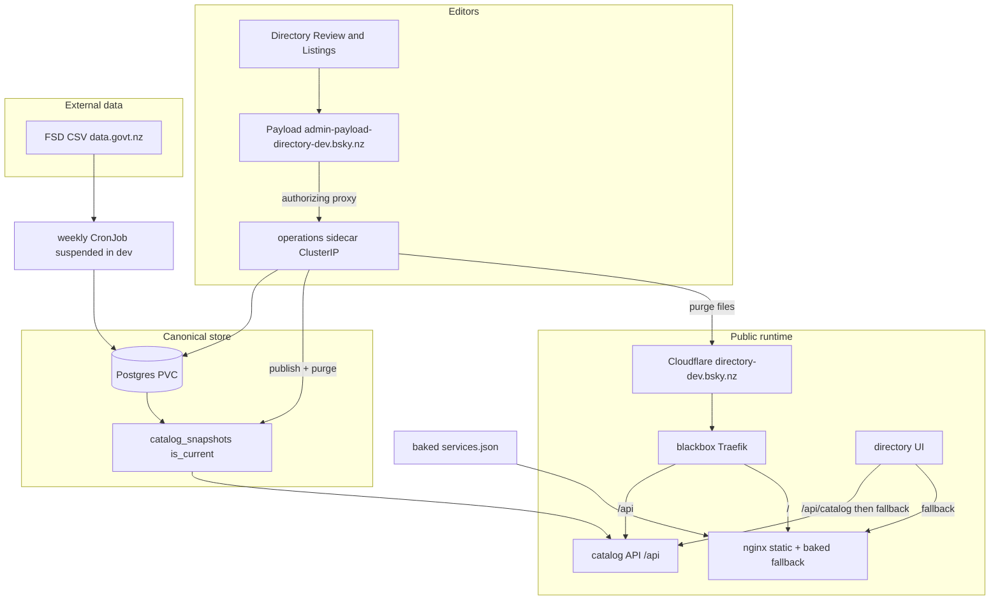

# Porirua Services Directory — Architecture

**Status (9 Sep 2026):** Phase 1 is live at [directory.bsky.nz](https://directory.bsky.nz) (nginx + baked JSON). Phase 2 (Postgres catalog, public read API, UI fallback, Payload Directory, weekly FSD runner) is live on the **dev** tenant only: [directory-dev.bsky.nz](https://directory-dev.bsky.nz) and [admin-payload-directory-dev.bsky.nz](https://admin-payload-directory-dev.bsky.nz). Directus is retired on directory-dev. **Prod Phase 2 is not built.**

This file is product-level system context. The verified services, cache path, images, secrets, and failure modes live in the companion [porirua-directory-deployment.md](./porirua-directory-deployment.md). Why the stack was chosen lives in [docs/decisions/](../decisions/README.md).

**Public URL (prod, Phase 1):** [https://directory.bsky.nz](https://directory.bsky.nz)
**App code:** [`porirua_directory/`](../../porirua_directory/)
**Connections Map (parallel):** [`porirua_connections_map/`](../../porirua_connections_map/)

---

## Purpose

One public directory for Porirua that serves three audiences:

1. **Immediate help** — for themselves or someone they know (need categories, crisis numbers, FSD-heavy listings).
2. **Community connection** — find and contact community groups (Connections Map, `orgType` filters).
3. **Civic & community places** — marae, councils, Pātaka Kai, and similar organisations curated locally.

Phase 1 is a **static site + generated JSON**. Phase 2 makes **PostgreSQL** the canonical store and serves a materialised Option B snapshot. directory-dev’s admin is Payload on `admin-payload-directory-dev.bsky.nz` (editor and publisher). **Cloudflare D1 + Workers** is a documented **exit** if that admin plane is withdrawn — export Postgres and keep the snapshot envelope. It is not the path being built.

---

## System context (dev)

On **prod** today the editor, API, Postgres, and CronJob subgraphs do not exist. Traffic is Cloudflare → origin `:4443` → Traefik → nginx:8080 → baked `data/services.json`.

---

## Repositories and ownership

| Location | Role |
|----------|------|
| `porirua-locality-preview` | Directory app, merge scripts, docs, Connections Map |
| `blackbox` | K8s tenants. Dev: `clusters/dev/tenants/porirua-directory/`. Prod: `clusters/prod/tenants/porirua-directory/` (Phase 1 nginx pin) |
| Porirua Locality Google Sheet | **Connections Map only.** Directory community listings are created in Payload Directory. Nothing syncs between them ([009](../decisions/009-google-sheet-retired-for-directory.md)) |

---

## Phase 1 — historical data flow

These steps still build the **baked fallback** and still describe how **prod** is published. They are not how directory-dev editors work.

1. **`npm run import:fsd`** — Download FSD CSV, filter to Porirua geography, write `data/fsd-porirua.raw.json` and audit file `data/fsd-porirua-excluded.json` (see [fsd-porirua-filter-rationale.md](../fsd-porirua-filter-rationale.md)).
2. **`npm run merge:services`** — Load Connections Map CSV (sheet URL or repo fallback), merge with FSD, apply `data/overrides.json`, dedupe (prefer community copy), write `data/services.json`.
3. **Deploy (prod today)** — Docker image includes static assets + `services.json`; pin `clusters/prod/tenants/porirua-directory/`.

### Phase 1 — public runtime (prod today)

| Layer | Technology |
|-------|------------|
| DNS / TLS edge | Cloudflare (`directory.bsky.nz`, proxied) |
| Origin | blackbox `101.100.135.172:4443` → Traefik → nginx:8080 |
| App | Vanilla HTML/JS/CSS, Leaflet, OpenStreetMap tiles; ES modules (`*.mjs`) — nginx must serve them as `application/javascript` ([`infra/nginx.conf`](../../porirua_directory/infra/nginx.conf)) |
| Data | Baked `GET /data/services.json`. `GET /api/catalog` on this host returns the **HTML homepage** (verified 8 Sep 2026). The UI tries `/api/catalog` first, fails the JSON shape check, and falls back. |

ExternalDNS on prod creates the `directory` record when Ingress is applied.

---

## Phase 2 — current stack (dev)

Authoritative detail: [porirua-directory-deployment.md](./porirua-directory-deployment.md). Decisions: [docs/decisions/](../decisions/README.md).

| Piece | What it is |
|-------|------------|
| Canonical store | Postgres. Publish materialises `catalog_snapshots` and flips `is_current` |
| Public read | `GET /api/catalog` (envelope as stored), `GET /api/health` |
| UI | Live API first; baked `data/services.json` if the API is missing, hung, or the wrong body |
| Admin | Payload on `admin-payload-directory-dev.bsky.nz` (`porirua_directory/payload/`) is the editor and the catalog publisher (`CATALOG_PUBLISHER=payload`). Directus is retired on directory-dev (replicas 0; `admin-directory-dev.bsky.nz` redirects here). Do not scale Directus back up: the live Directus pin has no publisher gate and would dual-publish. |
| Writes | Unauthenticated operations sidecar, ClusterIP only. The Payload `/api/directory-editor` proxy is the auth gate. NetworkPolicy admits `app: payload` (and still lists `app: directus` for a rollback). |
| Weekly FSD | `npm run sync:fsd` / CronJob — fills `review_queue_items`, **never publishes**. Suspended on directory-dev |
| Images | Five SHA-pinned app images from `workflow_dispatch`. `main` still builds nginx only |

Editors on directory-dev: Listings creates are published rows with no review-queue item; Review is government updates; near-name check warns and does not block. The public site updates on **Publish**, not on save. How to do that as Moana is the [editor one-pager](../design/editor-guide.md).

---

## Service record model (publishable)

See [Phase 1 spec](../porirua-directory-phase1-spec.md#service-record). Summary:

- Identity: `id`, `name`, `description`, `phone`, `url`, `address`, `lat`, `lng`
- Browse: `categories[]` (need/help), `communityFilters[]`, `orgType`
- Provenance: `source` (`community` | `fsd`), optional `badges` (public labels; community rows default to none)
- Dedup: `duplicateOf` (hidden from public list when set)

---

## Security

- Public site: read-only, no login, no PII collection from searchers.
- Prod (Phase 1): no admin host. Sheet + git-managed overrides were the Phase 1 editor path.
- Dev (Phase 2): one admin session. Payload on `admin-payload-directory-dev.bsky.nz` (Admin / Editor / Reviewer). The `/api/directory-editor` proxy uses `isEditorOrAdmin`; Viewers get **403** on Directory reads as well as writes. The operations sidecar has no auth of its own ([007](../decisions/007-operations-sidecar-networkpolicy.md)). Payload is the catalog publisher.
- Cloudflare Access + Worker is **not** what is built. It is part of the D1 exit, not an alternative admin path running today.

---

## Related documents

- [Deployment and services snapshot](./porirua-directory-deployment.md)
- [Decision records](../decisions/README.md)
- [Requirements](../porirua-services-directory-requirements.md)
- [Phase 1 technical spec](../porirua-directory-phase1-spec.md)
- [MVP runbook](../MVP-RUNBOOK.md)
- [Editor one-pager](../design/editor-guide.md)
- [Implementation checklist](../superpowers/plans/2026-07-30-porirua-services-directory-mvp.md)
