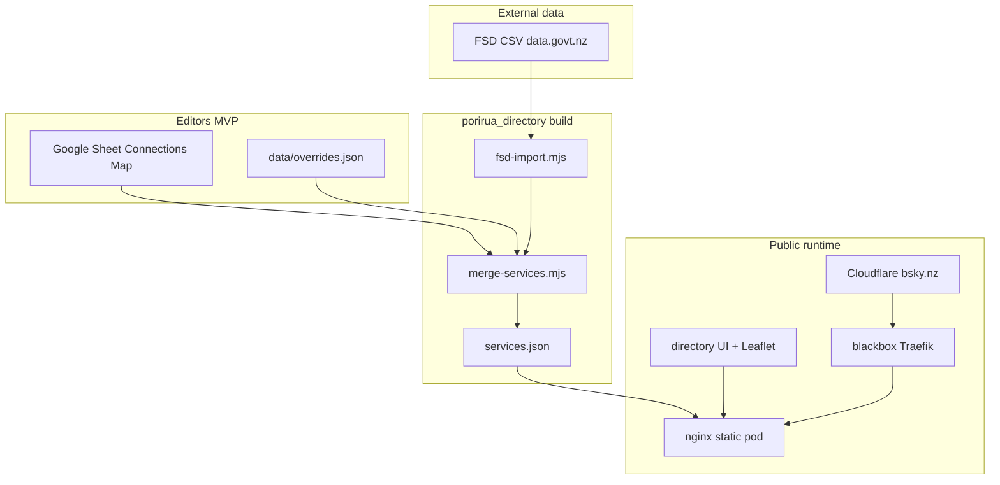

# Porirua Services Directory — Architecture

**Status:** Phase 1 (MVP) — UI, CI, and prod tenant manifests in repo; live at directory.bsky.nz after image push + Argo sync  
**Public URL (target):** [https://directory.bsky.nz](https://directory.bsky.nz)  
**App code:** [`porirua_directory/`](../../porirua_directory/)  
**Connections Map (parallel):** [`porirua_connections_map/`](../../porirua_connections_map/)

---

## Purpose

One public directory for Porirua that serves three audiences:

1. **Immediate help** — for themselves or someone they know (need categories, crisis numbers, FSD-heavy listings).
2. **Community connection** — find and contact community groups (Connections Map, `orgType` filters).
3. **Civic & community places** — marae, councils, Pātaka Kai, and similar organisations curated locally.

Phase 1 is a **static site + generated JSON**. Phase 2 adds editor workflows (Directus + Postgres is the requirements default; **Cloudflare D1 + Workers** is an alternative under evaluation).

---

## System context



---

## Repositories and ownership

| Location | Role |
|----------|------|
| `porirua-locality-preview` | Directory MVP, merge scripts, docs, Connections Map |
| `blackbox` | K8s tenant, Ingress `directory.bsky.nz`, [bsky.nz DNS](file:///Users/ira/repos/blackbox/infra/cloudflare/bsky.nz/README.md) |
| Porirua Locality Google Sheet | Community org inventory (shared with Connections Map) |

---

## Phase 1 — data flow

1. **`npm run import:fsd`** — Download FSD CSV, filter to Porirua geography, write `data/fsd-porirua.raw.json`.
2. **`npm run merge:services`** — Load Connections Map CSV (sheet URL or repo fallback), merge with FSD, apply `data/overrides.json`, dedupe (prefer community copy), write `data/services.json`.
3. **Deploy** — Docker image includes static assets + `services.json`; served at `directory.bsky.nz`.

Editors in MVP:

- Change community orgs in the **Google Sheet** (same as Connections Map).
- Hide or patch FSD rows via **`data/overrides.json`** (re-run merge after FSD import).

No admin database in Phase 1.

---

## Phase 1 — public runtime

| Layer | Technology |
|-------|------------|
| DNS / TLS edge | Cloudflare (`directory.bsky.nz`, proxied) |
| Origin | blackbox `101.100.135.172:4443` → Traefik → Service → nginx |
| App | Vanilla HTML/JS/CSS, Leaflet, OpenStreetMap tiles |
| Data | `GET /data/services.json` (static file) |

Traffic path (see blackbox `infra/cloudflare/bsky.nz/README.md`):

```
Browser → https://directory.bsky.nz → Cloudflare → origin :4443 → Traefik → pod:8080
```

ExternalDNS on prod creates the `directory` record when Ingress is applied.

---

## Phase 2 — target (requirements vs options)

**Requirements default (Appendix A):** PostgreSQL + **Directus** (admin UI + REST/GraphQL API) + weekly FSD job + publish pipeline to public JSON.

**Option under evaluation:** **Cloudflare D1** (SQLite) + **Workers** for admin API; publish export to `services.json` / R2 / blackbox. Does not use Directus without a custom admin UI.

Both options keep the **public site static**; the admin layer is separate from `directory.bsky.nz` (e.g. `admin.directory.bsky.nz` or internal host).

---

## Service record model (publishable)

See [Phase 1 spec](../porirua-directory-phase1-spec.md#service-record). Summary:

- Identity: `id`, `name`, `description`, `phone`, `url`, `address`, `lat`, `lng`
- Browse: `categories[]` (need/help), `communityFilters[]`, `orgType`
- Provenance: `source` (`community` | `fsd`), optional `badges` (public labels; community rows default to none)
- Dedup: `duplicateOf` (hidden from public list when set)

---

## Security (Phase 1)

- Public site: read-only, no login, no PII collection from searchers.
- Admin: none in Phase 1 (sheet + git-managed overrides only).
- Phase 2: authenticated admin (Directus roles or Cloudflare Access + Worker).

---

## Related documents

- [Requirements](../porirua-services-directory-requirements.md)
- [Phase 1 technical spec](../porirua-directory-phase1-spec.md)
- [MVP runbook](../MVP-RUNBOOK.md)
- [Implementation checklist](../superpowers/plans/2026-07-30-porirua-services-directory-mvp.md)
