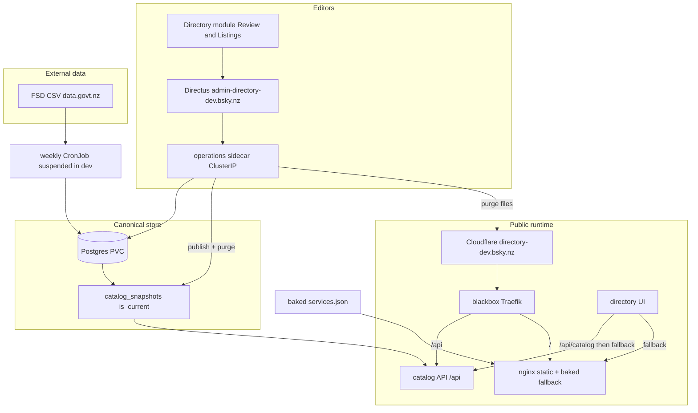
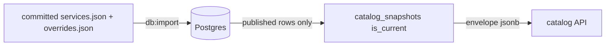

# Porirua Services Directory — Architecture

**Status:** Phase 1 live at directory.bsky.nz (nginx + baked JSON). Phase 2 catalog store, public read API, UI fallback, Directus editor, and weekly FSD runner are in this repo; the first live stack is the **dev** tenant at directory-dev.bsky.nz.  
**Public URL (target):** [https://directory.bsky.nz](https://directory.bsky.nz)  
**App code:** [`porirua_directory/`](../../porirua_directory/)  
**Connections Map (parallel):** [`porirua_connections_map/`](../../porirua_connections_map/)

---

## Purpose

One public directory for Porirua that serves three audiences:

1. **Immediate help** — for themselves or someone they know (need categories, crisis numbers, FSD-heavy listings).
2. **Community connection** — find and contact community groups (Connections Map, `orgType` filters).
3. **Civic & community places** — marae, councils, Pātaka Kai, and similar organisations curated locally.

Phase 1 is a **static site + generated JSON**. Phase 2 makes **PostgreSQL** the canonical store and serves a materialised Option B snapshot; Directus is the editor UI. **Cloudflare D1 + Workers** remains a documented exit, not the path being built.

---

## System context



---

## Repositories and ownership

| Location | Role |
|----------|------|
| `porirua-locality-preview` | Directory MVP, merge scripts, docs, Connections Map |
| `blackbox` | K8s tenant, Ingress `directory.bsky.nz`, [bsky.nz DNS](file:///Users/ira/repos/blackbox/infra/cloudflare/bsky.nz/README.md) |
| Porirua Locality Google Sheet | Connections Map only. Directory community listings are edited in Data Studio → Directory |

---

## Phase 1 — data flow

1. **`npm run import:fsd`** — Download FSD CSV, filter to Porirua geography, write `data/fsd-porirua.raw.json` and audit file `data/fsd-porirua-excluded.json` (see [fsd-porirua-filter-rationale.md](../fsd-porirua-filter-rationale.md)).
2. **`npm run merge:services`** — Load Connections Map CSV (sheet URL or repo fallback), merge with FSD, apply `data/overrides.json`, dedupe (prefer community copy), write `data/services.json`.
3. **Deploy** — Docker image includes static assets + `services.json`; served at `directory.bsky.nz`.

Editors (current):

- Change community listings in Data Studio → **Directory** (Listings tab). Creates are published rows with **no** review-queue item. The public site updates on **Publish**.
- Review FSD proposals on the **Review** tab. A removed row’s primary action is **Take it off the site** (hide + override), not Accept.
- Near-name check on create: `scripts/lib/name-match.mjs`. Do not change `normalizedOrgName` / clustering here — see [open-duplicate-org-cards](../issues/open-duplicate-org-cards.md).

---

## Phase 1 — public runtime

| Layer | Technology |
|-------|------------|
| DNS / TLS edge | Cloudflare (`directory.bsky.nz`, proxied) |
| Origin | blackbox `101.100.135.172:4443` → Traefik → Service → nginx |
| App | Vanilla HTML/JS/CSS, Leaflet, OpenStreetMap tiles; ES modules (`*.mjs`) — nginx must serve them as `application/javascript` ([`infra/nginx.conf`](../../porirua_directory/infra/nginx.conf)) |
| Data | `GET /api/catalog` (live snapshot); `GET /data/services.json` is a baked copy used only if the API is unreachable |

Traffic path (see blackbox `infra/cloudflare/bsky.nz/README.md`):

```
Browser → https://directory.bsky.nz → Cloudflare → origin :4443 → Traefik → nginx:8080
```

Phase 2 adds same-origin `GET /api/catalog` beside that path (Traefik `/api` → catalog API). The nginx image stays static-only.

ExternalDNS on prod creates the `directory` record when Ingress is applied.

---

## Phase 2 — catalog store (in repo now)

The **canonical model** is Postgres. The UI reads `/api/catalog` first and falls back to the baked `data/services.json` if the API is missing or returns the wrong body.

| Piece | Path |
|-------|------|
| Schema | `porirua_directory/scripts/db-schema.sql` |
| Test database | `porirua_directory/docker-compose.test.yml` |
| Pooled client | `porirua_directory/scripts/lib/db.mjs` (`DATABASE_URL` via `config.mjs`) |
| Bootstrap | `npm run db:import` — `db-import-from-json.mjs` |
| Publish / rollback | `npm run catalog:publish` — `publish-catalog.mjs` (purges the edge cache before reporting the version) |
| Local Directus | `porirua_directory/docker-compose.directus.yml` (own compose project / host port **54341**, not the catalog-API test port 54329) |
| Editor workspace | `porirua_directory/directus/snapshot.yaml`, `directus/flows/`, `scripts/directus/bootstrap.mjs` |
| Row ↔ envelope mapping | `catalog-rows.mjs`, `catalog-envelope.mjs` (pure; no clustering on read) |
| Public read API | `porirua_directory/api/` — `GET /api/catalog`, `GET /api/health` (plain `node:http`) |
| API image | `porirua_directory/Dockerfile.api` → `ghcr.io/irab/porirua-directory-api` |



**Publish** builds the Option B envelope from `status=published` rows (`draft`, `hidden`, `pending_review`, and `merged_into` are excluded), inserts a `catalog_snapshots` row, flips `is_current` in one transaction, then purges the public catalog URL. A failed purge is a failed publish. **Rollback** points `is_current` at an earlier version and purges the same way. Status changes alone do not go live.

**Bootstrap** loads today's committed JSON, persists grain and public ids, and seeds `raw_import` on every FSD line so the first weekly sync does not queue the whole catalog as changed. Two live cards share a public id (`org-te-waka-whaiora-trust`, `community-te-wahi-tiaki-tatou`); bootstrap makes `public_id` unique deterministically (winner keeps the bare id; the other gets `-<first 4 hex of sha256(cluster_key)>`). Cleaning those duplicates is an editor merge later — not a pipeline job.

**Counts:** `published`, `serviceLines`, and `organizations` are recomputed from the snapshot entries. `community`, `fsd`, and `duplicatesHidden` are merge-input sizes (382 FSD rows became 162 lines). Bootstrap copies them onto `import_runs.stats`; each weekly `npm run sync:fsd` run then writes a new `import_runs` row with included/excluded/collapsed/queue counts and refreshes `fsd` from that week's included slice.

**Tables:** `organizations`, `services`, `public_id_aliases`, `catalog_snapshots`, `overrides`, `import_runs`, `review_queue_items`. The last two ship complete for the sync task (`import_runs.stats` includes included/excluded/collapsed/queue counts; `review_queue_items.kind` is `new|changed|removed|geocode_flag`).

**Public catalog API** serves `catalog_snapshots.envelope` as stored — no `applyOrgGrouping`, no join of `organizations` / `services` on the request path. `ETag` is the snapshot `version`; `If-None-Match` returns 304. `Cache-Control` is `public, max-age=60, s-maxage=86400`. `?version=N` pins a historical snapshot. Envelope bodies are cached in process by version forever. The current-version pointer is re-checked on a short TTL (default 30s, `CATALOG_CURRENT_TTL_MS`) with `SELECT version FROM catalog_snapshots WHERE is_current`; a publish is therefore live within about a minute without rolling pods. A failed pointer refresh keeps the last known snapshot. With nothing cached it returns `{ "error": "catalog unavailable" }` (503). `GET /api/health` reports `database: reachable|unreachable` without connection strings or driver errors.

The static nginx pod and baked `data/services.json` stay as the UI fallback when `/api/catalog` is missing or returns the wrong body.

The weekly runner is `porirua_directory/scripts/fsd-sync-run.mjs` (`npm run sync:fsd`, image `Dockerfile.sync`). That image copies `scripts/`, `editor-core/`, and `config-directory.js` — `fsd-sync-run.mjs` imports the proposal fingerprint from `editor-core`. Kubernetes CronJob manifests live in the blackbox tenant. Approve, hide, and reject share `scripts/approve-review.mjs` (`approveReviewItem`) with the Directus sidecar. List-view multi-select is real for those three: the sidecar loops every `body.keys` item, keeps earlier successes when a later item fails, and returns per-item counts (HTTP 409 when any fail). Edit-and-approve and Roll back stay single-item and **400** if the trigger carries more than one key — they never truncate to `keys[0]`. Approve records no actor (no `approved_by` on `review_queue_items` yet) — a handover gap when Locality asks who signed off a change.

**Directus (editor workspace):** the Editor-facing UI is the **Directory module** (`directus/extensions/directory-editor/`) — one sidebar item, Review | Listings. Editors land on `/directory` after login (not empty Content). Raw `organizations`, `services`, `review_queue_items`, and `catalog_snapshots` are hidden from the nav. The Editor policy does **not** read `directus_flows`. The custom endpoint `/directory-editor` is the only authorisation gate (Editor or Admin) before proxying to the unauthenticated sidecar. A removed queue item archives via the hide path. Creates go through the sidecar (`scripts/listings.mjs`) and never insert `review_queue_items`. Sticky curation upserts one `overrides` patch row per FSD target. Approve refreshes `raw_import`. Keep-yours refreshes `raw_import` without overwriting live columns. Grain / `public_id` changes stay Admin-only. The fifth image is `ghcr.io/irab/porirua-directory-directus:<sha>` (dev pin only).

**Operations sidecar:** `directus/operations/server.mjs` remains ClusterIP-only (no Ingress, no auth). The module never calls it from the browser. Routes now include listings CRUD, name-matches, geocode, queue DTOs, keep-curation, and the existing review/publish endpoints. `Dockerfile.operations` copies `scripts/`, `editor-core/`, `config-directory.js`, and `directus/` — listings and undo-publish import those shared modules at load time, so omitting them crash-loops the sidecar before `/health` binds. Local compose publishes `18790` only so tests can reach it. Publish needs `CLOUDFLARE_ZONE_ID` and `CLOUDFLARE_API_TOKEN` for the edge purge. Never set `CATALOG_SKIP_PURGE` on a tenant.

**Dev tenant** (this stack): `https://directory-dev.bsky.nz` (nginx + `/api`) and `https://admin-directory-dev.bsky.nz` (Directus). Manifests: blackbox `clusters/dev/tenants/porirua-directory/`. Images are pinned to an immutable app-repo SHA (`ghcr.io/irab/porirua-directory{,-api,-sync,-operations,-directus}:<sha>`), never a floating `:dev`. `CATALOG_CURRENT_TTL_MS` is `5000` in dev. `/api` is a separate Traefik Ingress (priority 200) so it is not stolen by the site `/` router. The operations Service is ClusterIP-only; a NetworkPolicy allows Directus → operations:8790 and operations → Postgres, and excludes operations from the tenant-wide same-namespace and Traefik allow lists. Never set `CATALOG_SKIP_PURGE` on the tenant. Prod is out of scope for this editor change.

**Admin host** stays separate from the public directory host. Production will choose its own admin hostname in a gated prod task. D1 + custom admin is an exit if Directus is withdrawn — export Postgres and keep the snapshot envelope.

---

## Service record model (publishable)

See [Phase 1 spec](../porirua-directory-phase1-spec.md#service-record). Summary:

- Identity: `id`, `name`, `description`, `phone`, `url`, `address`, `lat`, `lng`
- Browse: `categories[]` (need/help), `communityFilters[]`, `orgType`
- Provenance: `source` (`community` | `fsd`), optional `badges` (public labels; community rows default to none)
- Dedup: `duplicateOf` (hidden from public list when set)

---

## Security (Phase 1)

- Public site: read-only, no login, no PII collection from searchers.
- Admin: none in Phase 1 (sheet + git-managed overrides only).
- Phase 2: authenticated admin (Directus roles or Cloudflare Access + Worker).

---

## Related documents

- [Requirements](../porirua-services-directory-requirements.md)
- [Phase 1 technical spec](../porirua-directory-phase1-spec.md)
- [MVP runbook](../MVP-RUNBOOK.md)
- [Implementation checklist](../superpowers/plans/2026-07-30-porirua-services-directory-mvp.md)
