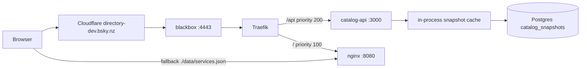
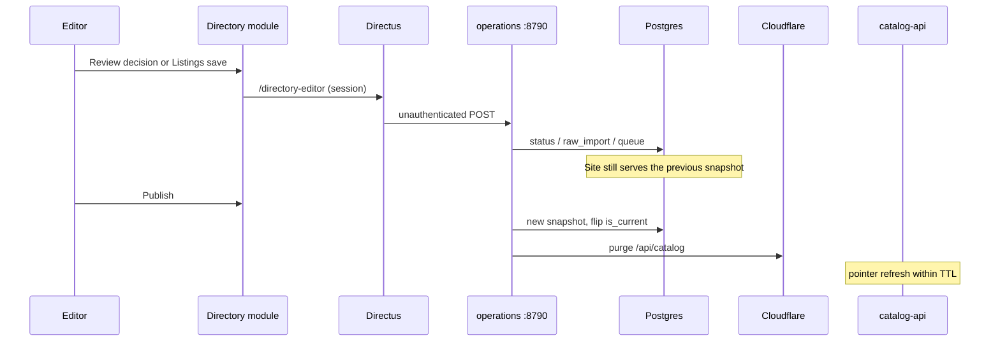
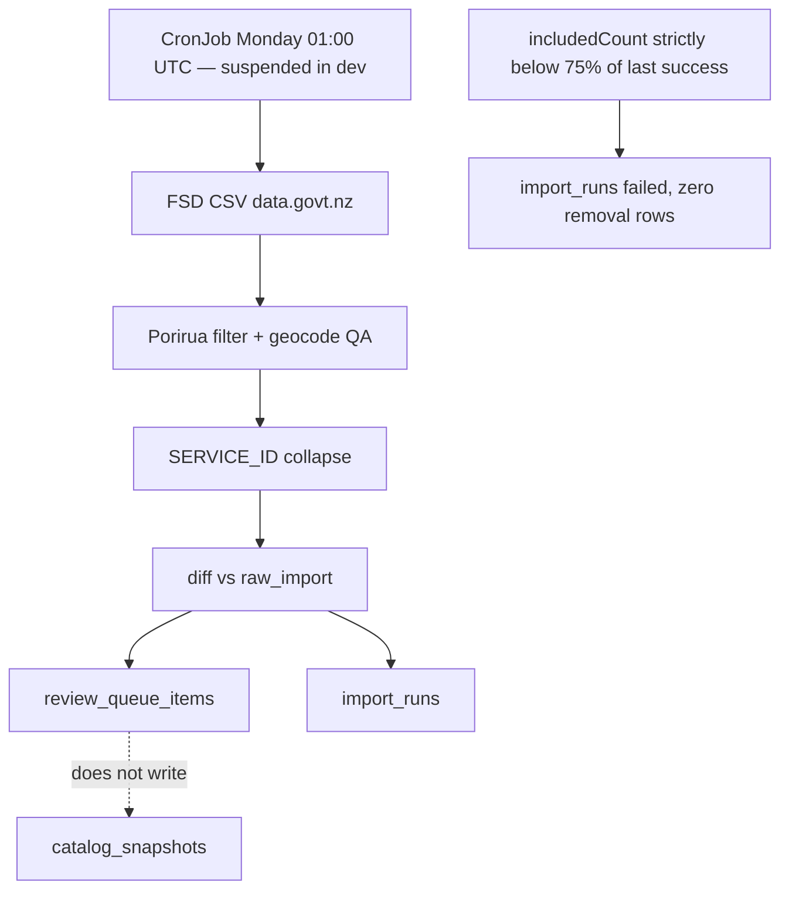

# Porirua Directory — deployment and services (as of 8 Sep 2026)

This is the services and deploy snapshot. It describes the system that **exists**, not the one someone intended.

Product context (audiences, Phase 1 model, why the directory exists) stays in [porirua-directory-architecture.md](./porirua-directory-architecture.md). Why the stack was chosen is in [docs/decisions/](../decisions/README.md). How Moana uses Review and Listings is the editor-guide / handover task — not this file.

**Prod Phase 2 is not built.** Sentences about Postgres, `/api/catalog`, Directus, the sidecar, or the CronJob apply to **directory-dev** unless they say otherwise.

## Verification banner

Checked on 8 Sep 2026. Do not treat a later pin as implied.

| What | Value that day |
|------|----------------|
| App tree this document was written against | `4e3a3d1` (`feature/payload-directory-ed-oi4` — Payload `image-dev` pin) |
| `origin/main` of this repo | `db282d3` — Phase 1 only |
| blackbox `origin/main` (before this Payload pin) | `bf0dae2` |
| directory-dev catalog / Directus / sidecar pin | `b65e5d723e344f6ea36b29d23219cde27c022a93` — unchanged; Directus stays the publisher (`CATALOG_PUBLISHER=directus`) |
| directory-dev Payload pin | `4e3a3d1227748c190583a19e7b9254228d4c9984` — `ghcr.io/irab/porirua-directory-payload` only (blackbox `e077b59`, PR #105) |
| Live Payload editor sign-in | `200` as Editor on `https://admin-payload-directory-dev.bsky.nz`; `/publish-status` 143 unpublished, `/queue` 13 to review, `/listings` real organisations |
| Live Payload editor map | Leaflet on OpenStreetMap tiles. Review card that moves a pin: 6/6 tiles. Listing form: 3/3 tiles, draggable marker, `© OpenStreetMap` credited. The Taeaomanino Trust card is 267px tall, not the 1301px it was when a bare `.verify` inherited Payload's `min-height: 100vh` |
| Payload editor e2e against that host | 6 passed, 1 skipped (`createdBy` needs the local operations mock). The Review decision step also skipped: it will not decide a real government row |
| Prod image pin | `ghcr.io/irab/porirua-directory:ec5c102a9fcbcfa5af356508ac4b8dea5cda6262` (nginx only) |
| Live `GET https://directory-dev.bsky.nz/api/catalog` | `200` `application/json`, `Cache-Control: public, max-age=60, s-maxage=86400`, `ETag: "13"`, `generatedAt` `2026-09-08T10:06:15.248Z`, 145 services |
| Live `GET https://directory-dev.bsky.nz/api/health` | `{"ok":true,"database":"reachable"}` |
| Live `HEAD https://directory-dev.bsky.nz/api/catalog` | `404` `{error:"not found"}` — the API handles **GET only** (`api/server.mjs`). Not fixed here. |
| Live `GET https://directory.bsky.nz/api/catalog` | `200` `text/html` — the Phase 1 homepage. There is no catalog API on prod. |
| `cf-cache-status` on the catalog GET | `DYNAMIC` (this curl did not observe a HIT). The API still *advertises* `s-maxage=86400`. |

Catalog / Directus / sidecar manifests stay on blackbox `origin/main` (`bf0dae2`). The Payload admin pin is a **dev-only** addition under `clusters/dev/tenants/porirua-directory/`. Do not read a later Payload SHA as a Directus repin.

---

## What exists

### Dev (`dev-porirua-directory`)

Public site: [https://directory-dev.bsky.nz](https://directory-dev.bsky.nz)
Admin (live publisher): [https://admin-directory-dev.bsky.nz](https://admin-directory-dev.bsky.nz)
Admin (Payload, side-by-side, not the publisher): [https://admin-payload-directory-dev.bsky.nz](https://admin-payload-directory-dev.bsky.nz)

One publisher: `CATALOG_PUBLISHER` is `directus` or `payload` (default `directus`). Both authorizing proxies refuse `POST /publish` and `POST /undo-publish` when they are not that host. directory-dev stays Directus. **Flipping to `payload` is not a Payload-only env change.** The Directus image must already include the same gate (otherwise Directus keeps publishing while Payload also can). Set the same value on both admin Deployments in one change. Report that blackbox change; do not dual-enable.
Manifests: blackbox `clusters/dev/tenants/porirua-directory/`
Namespace: `dev-porirua-directory`

| Workload | Responsible for | Site stays up if it fails? |
|----------|-----------------|----------------------------|
| nginx `porirua-directory` | Static UI + baked `data/services.json` | **No** — no HTML |
| `catalog-api` | `GET /api/catalog`, `GET /api/health` | **Yes** — UI falls back to baked JSON (stale) |
| Postgres `postgres:16-alpine` + PVC | Canonical store, snapshots, queue | API serves the last in-process snapshot if it already had one; otherwise `503`; UI then falls back |
| `operations` ClusterIP `:8790` | Publish, review, listings writes, purge | Public site unchanged (last snapshot). Editors cannot save or publish |
| Directus + Directory module image | Admin UI (live publisher) | Public site unchanged |
| Payload admin | Replacement Directory admin + `/api/directory-editor` auth gate. Own `porirua_payload` database. Publish/undo are refused while `CATALOG_PUBLISHER=directus` | Public site unchanged |
| `fsd-sync` CronJob | Weekly review-queue fill | Public site unchanged. **`suspend: true` in dev** |
| `catalog-bootstrap` / `directus-bootstrap` / `payload-db-init` Jobs | First sync / each Argo hook / create `porirua_payload` if missing | N/A after first success; a bad Directus bootstrap can hide the module |

### Prod (`prod-porirua-directory`) — Phase 1 only

Public site: [https://directory.bsky.nz](https://directory.bsky.nz)

One Deployment, one Service, one Ingress, nginx image pinned to `ec5c102…`. No Postgres, no API, no Directus, no sidecar, no CronJob. A visitor who requests `/api/catalog` receives the homepage HTML.

---

## How a public request reaches data



On **prod** the Traefik `/api` hop does not exist. Cloudflare → origin `:4443` → Traefik → nginx:8080 → baked JSON loaded as `./data/services.json` (the UI still *tries* `./api/catalog` first, gets HTML, fails the shape check, and falls back).

### Cache layers (dev)

| Layer | Behaviour |
|-------|-----------|
| Browser | `max-age=60` |
| Shared / edge | advertised `s-maxage=86400`; publish must purge ([004](../decisions/004-cloudflare-purge-on-publish.md)) |
| API process | envelope **bodies** cached forever by version; **pointer** re-checked every `CATALOG_CURRENT_TTL_MS` (5000 on directory-dev, 30000 default) |
| UI fallback | baked `data/services.json` after 4s timeout, non-JSON, or a body without `services[]` |

`ETag` is the snapshot version (`"13"` on the day this was re-checked). `If-None-Match` returns 304. `?version=N` pins a historical snapshot without flipping `is_current` (verified `?version=1` → `ETag: "1"`).

---

## How an editor change reaches the public site



Creates never insert `review_queue_items` ([010](../decisions/010-archive-create-through-name-check.md)). Review is government-only. Status writes do not go live until Publish. A failed purge restores the previous `is_current` ([004](../decisions/004-cloudflare-purge-on-publish.md)). Undo publish is version-checked ([018](../decisions/018-undo-publish-version-guard.md)).

The sidecar has no auth. NetworkPolicy is the boundary ([007](../decisions/007-operations-sidecar-networkpolicy.md)). `operations-from-directus-only` admits pods labelled `app: directus` **or** `app: payload` to `:8790`. Directus stays the live publisher (`CATALOG_PUBLISHER=directus`). Payload may save through the same sidecar; its proxy refuses `/publish` and `/undo-publish` unless that env is `payload`. The browser never calls `:8790`. The sidecar stays ClusterIP with no Ingress. Never set `CATALOG_SKIP_PURGE` on a tenant.

Editor-facing copy of this path belongs to the handover task. This section is the technical path only.

---

## How the weekly government sync gets data in



It **stops short of publishing**. No `catalog_snapshots` row, no `is_current` flip, no purge. New FSD inserts are `pending_review`; `changed` items leave `services.status` as the editor left it ([013](../decisions/013-status-write-rules.md)).

On directory-dev the CronJob is `suspend: true` (`0 1 * * 1`, `concurrencyPolicy: Forbid`, `backoffLimit: 1`). The Job template waits for Postgres with the same busybox `nc -z postgres 5432` init as catalog-bootstrap. A one-off proof:

```bash
kubectl -n dev-porirua-directory create job fsd-sync-manual --from=cronjob/fsd-sync
```

(Investigation only; this document does not run that.)

---

## Images

| Image | Dockerfile | Built by | Tags |
|-------|------------|----------|------|
| `ghcr.io/irab/porirua-directory` | `porirua_directory/Dockerfile` | `image` on push to `main`, **and** `image-dev` on `workflow_dispatch` | `:latest` + SHA on main; SHA only on dispatch |
| `ghcr.io/irab/porirua-directory-api` | `Dockerfile.api` | `image-dev` only | SHA |
| `ghcr.io/irab/porirua-directory-sync` | `Dockerfile.sync` | `image-dev` only | SHA |
| `ghcr.io/irab/porirua-directory-operations` | `Dockerfile.operations` | `image-dev` only | SHA |
| `ghcr.io/irab/porirua-directory-directus` | `Dockerfile.directus` | `image-dev` only | SHA |
| `ghcr.io/irab/porirua-directory-payload` | `Dockerfile.payload` | `image-dev` only | SHA |
| `postgres:16-alpine` | upstream | n/a | floating minor |
| `busybox:1.36` | upstream | n/a | wait-for-postgres init |

Trigger for the six SHA tags:

```bash
gh workflow run directory.yml --ref <branch>
```

A push to `main` still builds nginx only (`4927491`). That is why a merge-to-main cannot produce the pins a Phase 2 prod tenant would need (blackbox PR #79).

**Running version** = the SHA in the blackbox pin, not “whatever is on `main`”, and not necessarily this repo’s HEAD. On 8 Sep 2026 directory-dev catalog/Directus/sidecar ran `b65e5d7` while Payload was pinned separately at `8a5f30b`.

Never pin `:dev` or a floating `:latest` on the tenant. A pin is not done until an Editor session after the roll shows Review / Listings (`e76d04c`).

`Dockerfile.operations` must copy `scripts/`, `editor-core/`, `config-directory.js`, and `directus/` or the sidecar crash-loops before `/health` binds (`db88bcc`).

`Dockerfile.payload` must copy `editor-core/` and `config-directory.js` so `/api/directory-editor` stays the shared authorizing proxy.

A production Payload image never `push`es schema (`@payloadcms/db-postgres` skips push whenever `NODE_ENV` is `production`), and `next start` never runs the config's `onInit`. So `npm run start:migrate` does both jobs in order before serving: `payload migrate` applies `src/migrations`, then `payload run src/seed-cli.ts` creates any missing editor account. Both are idempotent and log what they did. Migrations alone leave the tables empty, which reads as a working admin where every sign-in returns 401. `PAYLOAD_PUSH_SCHEMA` is gone; it was a no-op on a built image.

---

## Secrets, ingress, DNS, CronJob (dev today)

### Secrets

SealedSecret `porirua-directory-secrets`. Required **keys** (from `secret.example.yaml` — values are not repeated here):

`DATABASE_URL`, `POSTGRES_PASSWORD`, `CLOUDFLARE_ZONE_ID`, `CLOUDFLARE_API_TOKEN` (must be able to POST purge), `DIRECTUS_SECRET`, `ADMIN_EMAIL`, `ADMIN_PASSWORD`, `EDITOR_EMAIL`, `EDITOR_PASSWORD`.

SealedSecret `porirua-payload-secrets` (separate — do not copy the catalog `DATABASE_URL` into it): `PAYLOAD_SECRET`, `REVIEWER_EMAIL`, `REVIEWER_PASSWORD`. Admin and Editor seed accounts reuse the first secret. The Payload pod builds a `postgres://…/porirua_payload` URL at startup from `POSTGRES_PASSWORD`.

SealedSecrets cannot unseal until the namespace exists. After first sync, copy `ghcr-io` from `dev-polis` (private GHCR). Do not copy either SealedSecret toward prod.

ConfigMap `porirua-directory-config`: `CATALOG_PUBLIC_URL=https://directory-dev.bsky.nz/api/catalog`, `CATALOG_CURRENT_TTL_MS=5000`, `DIRECTUS_PUBLIC_URL=https://admin-directory-dev.bsky.nz`, `PAYLOAD_PUBLIC_URL=https://admin-payload-directory-dev.bsky.nz`, `PAYLOAD_DB=porirua_payload`, `OPERATIONS_URL=http://operations:8790`. Never set `CATALOG_SKIP_PURGE` on the tenant.

### Ingress and DNS

- ExternalDNS creates proxied A records `directory-dev`, `admin-directory-dev`, and `admin-payload-directory-dev` → `101.100.135.172`.
- TLS: Cloudflare Universal on `*.bsky.nz`. No in-cluster TLS secret.
- Cloudflare Flexible → origin `:4443` → Traefik. Public URLs do not include `:4443`.
- `/api` Ingress priority 200; `/` priority 100 ([021](../decisions/021-split-api-ingress.md)).
- Directus admin is `admin-directory-dev.bsky.nz` → Directus `:8055`.
- Payload admin is a fourth Ingress on `admin-payload-directory-dev.bsky.nz` → Payload `:3000`. Dev only.
- Ingress health checks are disabled: Traefik never writes `status.loadBalancer`.

### Boot order

| Wave | Resources |
|------|-----------|
| 0 | ConfigMap, SealedSecrets, NetworkPolicies, Postgres |
| 1 (Sync hook) | `catalog-bootstrap` — schema + `db-import-from-json.mjs` + first publish if no `is_current`. `payload-db-init` — `CREATE DATABASE porirua_payload` if missing |
| 2 | operations, catalog-api, nginx, Directus, Payload, FSD CronJob (suspended) |
| 3 (Sync hook) | `directus-bootstrap` + `https-proto` middleware — **before** Ingress |
| 4 | Ingresses (`DisableResourceHealthCheck`) |

### NetworkPolicy

`_base` default-deny, then allow-same-namespace and allow-ingress-controller are **patched** so they do not select `app=operations`. `operations-from-directus-only` allows Directus **or** Payload → `:8790` (two `from` podSelectors; Directus is not removed) and operations → Postgres `:5432`. Operations still matches `_base` `allow-dns` and `allow-egress-internet` (80/443) so purge can reach Cloudflare.

### CronJob

`fsd-sync`: `0 1 * * 1`, **suspended**, waits for Postgres. Writes `review_queue_items` and `import_runs` only.

---

## Failure modes (outside view)

| Failure | Visitor sees | Editor sees |
|---------|--------------|-------------|
| Postgres down | Last in-process snapshot if the API already had one; otherwise API `503` and the UI shows baked JSON | Review / listings / publish fail |
| API down, hung >4s, or non-JSON (including HTML) | Baked `data/services.json` (stale). Playwright asserts which source was consumed | Publish may still write Postgres; the public site looks unchanged until the API returns |
| Sidecar down | Last snapshot, unchanged | Module actions fail |
| Bad publish / purge fail | Previous snapshot stays current | Publish errors; `is_current` is not left on the new row |
| Directus down / module 401 | Unchanged | Login or “Page Not Found”; pin is not done |
| Payload down / auth gate 401 | Unchanged | Payload admin unavailable; Directus still publishes (`CATALOG_PUBLISHER=directus`) |
| Weekly CronJob fail / sanity abort | Unchanged | Queue does not grow; `import_runs.status='failed'` |
| Nginx down | Site down | Admin may still work on the other hosts |

HEAD `/api/catalog` returning 404 is not a visitor path (the UI uses GET). It is a footgun for anyone health-checking with `curl -I`.

---

## What differs between dev and prod today

| | directory-dev | directory.bsky.nz (prod) |
|--|---------------|---------------------------|
| Stack | Five catalog images + Payload admin + Postgres + Directus + sidecar + suspended CronJob | nginx only |
| `/api/catalog` | JSON snapshot (ETag 13 on 8 Sep 2026) | HTML homepage |
| Admin host | `admin-directory-dev.bsky.nz` (publisher) and `admin-payload-directory-dev.bsky.nz` | **None** |
| Publish | Snapshot + Cloudflare purge from Directus | Rebuild + pin nginx SHA |
| Weekly FSD | Runner exists, CronJob suspended | Not present |
| Image build | `workflow_dispatch` six SHAs | `main` push builds nginx |

## What prod still requires (not yet true)

Do not read this list as a description of prod.

- A same-turn human authorisation to touch `clusters/prod/**` ([016](../decisions/016-dev-first-prod-gated.md)).
- A decision on how to obtain API / sync / operations / Directus images: build them on `main`, or pin `image-dev` SHAs. As the workflow stands, a merge-to-main cannot produce those four tags.
- Postgres + a **new** PVC. Do not copy the directory-dev volume.
- Re-sealed secrets. Do not copy the directory-dev SealedSecret.
- Split `/api` Ingress, an admin hostname (not chosen), NetworkPolicy around operations, real purge with a prod `CATALOG_PUBLIC_URL`.
- CronJob unsuspended only when editors are ready for a weekly queue.
- The Directory module image — do not pin stock `directus/directus`.
- Editor `last_page` / session-cookie lessons; pin-not-done-until-Editor-click.

The gated sibling task `2d2a4674-4e61-4479-9bac-f8defe131088` owns that work. This document does not start it.

---

## Related

- [Decision records](../decisions/README.md)
- [Product architecture](./porirua-directory-architecture.md)
- [MVP runbook](../MVP-RUNBOOK.md) — local commands and editor-module operational notes (handover task will consolidate)
- [Editor one-pager](../design/editor-guide.md) — not rewritten here
- blackbox tenant README: `clusters/dev/tenants/porirua-directory/README.md` on directory-dev (dev only; do not copy to `clusters/prod/**`)
