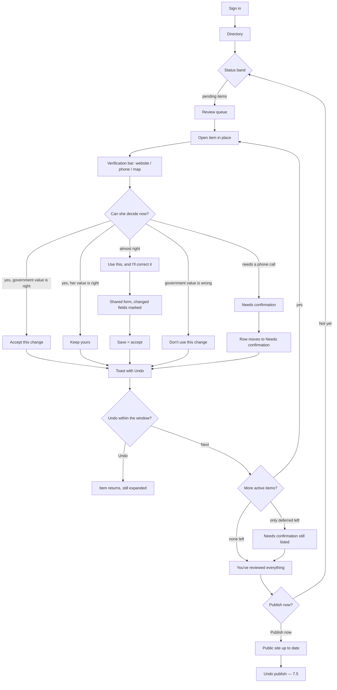
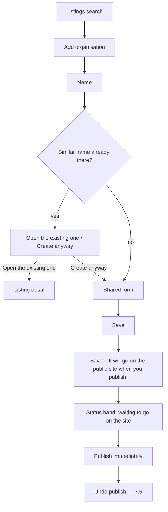
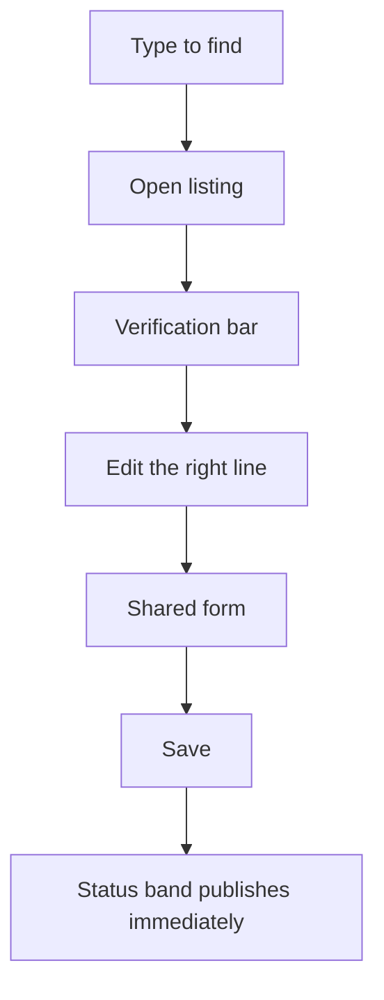
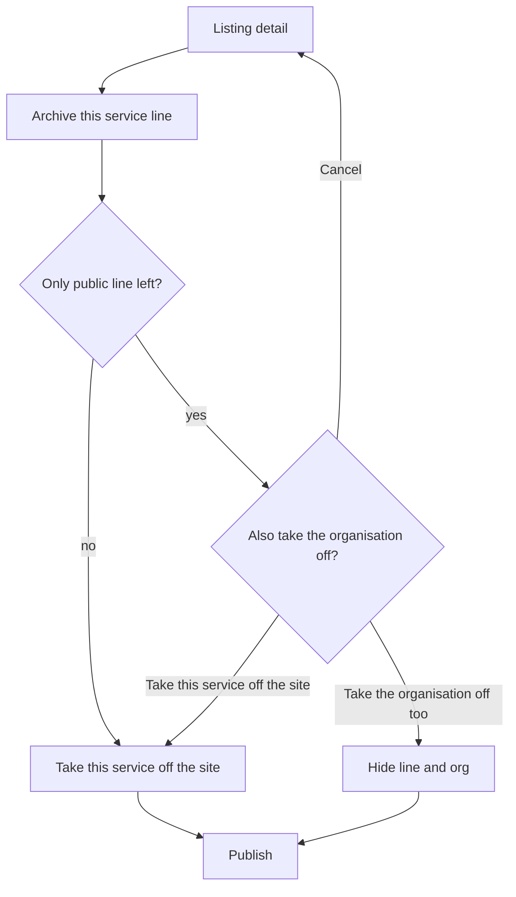

# Directory editor — interface design

**Status:** Design accepted 8 Sep 2026. Section 12 is decided. The Vue sketch is not the approved UI — rebuild it to this document.  
**Audience:** Moana (editor), Kahu (readiness walk), Aroha (product).  
**Not this doc:** sidecar contracts, the name matcher, clustering, the three-way lock rule, Kubernetes. Those stay as they are.  
**Undo publish (7.5)** is agreed (8 Sep 2026) and is to be built with the two-editor version guard and a persist-only audit of who published and who undid.

This is a design from **jobs**, not from the code already in the module. Where the current build should be changed or thrown away, this document says so.

Related: [editor-guide](./editor-guide.md) (today’s one-pager) · [admin-testing-personas](./admin-testing-personas.md) (E-01, P-01–P-03).

---

## 1. Two jobs, two shapes

There are two jobs wearing one uniform.

| Job | Shape | She arrives because | She leaves when |
|-----|--------|---------------------|-----------------|
| **Reviewing** | Queue-driven, reactive | The government feed changed | Every item is decided, deferred, or the hour is up — then Publish |
| **Maintaining** | Search-driven, proactive | Someone told her a phone number moved | The listing is saved — then Publish |

Keep **Review** and **Listings** as equal tabs under one **Directory** item. Do not merge them into one generic table. Do not add a third “home” screen — the status band (below) is the home.

**Review** is a queue of decisions. **Listings** is find → open → change. They share a status band, a verification bar, a form, and Publish. They do not share a row layout.

---

## 2. What the current build gets wrong

Said plainly, so we do not rationalise it:

| Job | Current module | This design |
|-----|----------------|-------------|
| See the change | Field diffs were added late; still no way to check the organisation’s own website without losing the queue | Verification bar on every change and every listing; new tab on purpose |
| Decide later | Only Accept / Keep yours / Reject. Leaving the item means Reject or walking away with it still “new” | **Needs confirmation** — stays pending, marked deferred, not a decision |
| Government dropped a service | Only **Take it off the site**. That treats “gone from FSD” as “closed” | Two **equal** options: take it off, or **keep it as a community listing** |
| Nearly-right FSD change | Accept, then hunt the listing to fix it | **Use this, and I’ll correct it** — edit-then-accept in one movement |
| Find a listing | Flat table of ~145 names (search was bolted on) | Search is the listings screen; results are the way in, not a filter on a spreadsheet |
| Open a listing | Clicking a row opened the edit form, so “pick this org to add a line” dumped her into editing | Select and edit are different. Opening a listing shows the org, its lines, and the verification bar |
| Archive | Browser `confirm`, then a later Directus dialog still tied to “the form you happen to be in” | Archive from listing detail, with a real choice about the organisation |
| Finish the hour | Empty table + a banner she may not connect to the work | Count while she works; explicit finish that leads into Publish |
| Publish | One button, no naming of what goes public | Publishes immediately. **Undo publish** is the safety net (7.5) |
| Login | Bootstrap hides Content, then Directus still opens Content | Land on Directory. Status band answers “what should I be doing?” |

Contracts, matcher, and the lock rule stay. The Vue is a sketch. Rebuild the interface to match this document.

---

## 3. Copy dictionary

Copy is the product. No raw enums, no column names, no JSON. These are the words unless a later decision replaces them.

### Status and kinds

| Internal | She sees |
|----------|----------|
| `changed` | **Details changed** — or a summary of the fields: **Phone and address changed** |
| `new` | **New service** |
| `removed` | **Gone from the government list** |
| `geocode_flag` | **Check the map pin** |
| `published` | **On the site** |
| `hidden` / `draft` | **Off the site** |
| Deferred pending item | **Needs confirmation** (badge on the row) |

### Review actions

| Situation | Buttons |
|-----------|---------|
| Details changed | **Accept this change** · **Keep yours** (only if she set that field) · **Use this, and I’ll correct it** · **Don’t use this change** · **Needs confirmation** |
| New service | **Add this service** · **Don’t add this** · **Needs confirmation** |
| Gone from the government list | **Take it off the site** · **Keep it as a community listing** — **equal weight, no visual hierarchy, no keyboard default** · **Needs confirmation** |
| Check the map pin | **The pin is fine** · **I’ll move the pin** · **Needs confirmation** |
| After any decision | **Undo** (on the toast) · **Next** (does not auto-expand) |

**Don’t use this change** and **Don’t add this** are decisions: the government proposal is declined, that week’s value will not be asked again unless FSD moves again.  
**Needs confirmation** is not a decision: the item stays pending and marked. If next week’s proposal is the same, it stays in **Needs confirmation**. If the proposal itself changed, the mark dies and the row returns to the active list (7.1).

### Listings actions

| Button | Means |
|--------|--------|
| **Find an organisation** | Search field label |
| **Add organisation** | New community org |
| **Add a service line** | New line on the open (or selected) org, including an FSD one |
| **Edit** | Open the shared form for that org or that line |
| **Archive this service line** | Take this line off the public site after Publish |
| **Put it back on the site** | Restore an archived line / org |
| **Show listings that are off the site** | Archived filter |
| **Open the existing one** | Duplicate warning, primary |
| **Create anyway** | Duplicate warning, secondary |

### Publish and confirmations

| Moment | Words |
|--------|--------|
| Status band, review | **4 changes to review** |
| Status band, unpublished | **2 waiting to go on the site** |
| After Accept | **Accepted. It will go on the public site when you publish.** |
| After Keep yours | **Kept your details. They stay as you set them.** |
| After Don’t use this change | **Change declined. The listing stays as it is.** |
| After Don’t add this | **Not added. It will not go on the public site.** |
| After Take it off the site | **Taken off the site. It will leave the public site when you publish.** |
| After Keep it as a community listing | **Kept. This is now a community listing. Next week’s government feed will not take it off.** |
| After Needs confirmation | **Needs confirmation. It stays in Review.** |
| After Save | **Saved. It will go on the public site when you publish.** |
| After restore | **Put back on the site. It will go on the public site when you publish.** |
| Queue empty after work | **You’ve reviewed everything. Put 4 changes on the public site.** |
| After Publish | **Published. The public site is up to date.** **Undo publish** |
| After Undo publish | **Publish undone. Those changes are waiting to go on the site again.** |
| After any Review decision | Same sentence as above, plus **Undo** on the toast (see 7.4) |
| Proposal changed under a defer | **This update changed since you set it aside.** (row returns to the active list) |
| FSD listed a community-kept row again | **The government listed this again** |

**You set this earlier** — on a changed field she has already curated (the Ora Toa address is the first live example).

---

## 4. Shared pieces

### 4.1 Persistent status band

Always visible at the top of Directory, both tabs.

```
[ 4 changes to review ]   [ 2 waiting to go on the site ]
```

- Both parts are buttons.
- **4 changes to review** opens Review (and scrolls to the first item that is not deferred).
- **2 waiting to go on the site** publishes immediately (no confirmation). Disabled while a publish is in flight.
- If a count is zero, show it subdued, still visible, not clickable: **Nothing to review** · **Nothing waiting to go on the site**.
- While Undo publish is available (7.5), the band also shows **Undo last publish**.
- This answers “what should I be doing?” without a home screen.

**Implementation note (not free):** `/publish-status` today returns `{ unpublished: boolean, currentVersion, nextCounts }`. The band needs an integer. Extend that payload when this design is built — do not invent the count in the browser by guessing. Names are still useful for the finish copy and for Undo publish context; they are not a confirmation step.

**Current build:** a warning banner only when something is unpublished, plus a Review tab label. Discard the “notice the banner” pattern.

### 4.2 Verification bar

On every expanded Review item and every listing detail.

| Control | Behaviour |
|---------|-----------|
| **Website** | Opens the organisation website in a **new tab**. Uses the government URL if present, otherwise the live listing URL. Hidden if neither exists. |
| Phone | `tel:` link, shown as the number she already understands |
| Address | Shown as the address text **and**, when coordinates exist, a map (Leaflet, same as the public site). Never show latitude or longitude. On Review, the map is the before/after pin when the pin moved; otherwise the current pin. |

The address text is a complete path. The map is a check and a nudge, not the only way to set a place (see 4.3 and §14).

The new tab is deliberate. The queue must not navigate. When she comes back, the same item is still expanded.

This is the difference between rubber-stamping and reviewing. The fastest check that a new phone number is right is the organisation’s own site.

**Current build:** no verification bar.

### 4.3 Shared form

One layout for **Add organisation**, **Add a service line**, and **Edit**. Same fields, same order, same map.

1. Name  
2. Description  
3. Address (type or look up — this **is** the location). Map appears when a lookup or an existing pin has a place; **drag the pin if the place is wrong**. Saving an address with no pin is valid. She must never be unable to set a place because she cannot drag.  
4. Phone  
5. Website  
6. Help types (existing chips only)  
7. Community groups (existing chips only)  

Footer: **Save** · **Cancel**  
On edit of a service line: also **Archive this service line**.

When this form opens from **Use this, and I’ll correct it** (or **I’ll move the pin**):

- Visually mark every field the proposal changed. The mark is text (**Changed in this update**) plus a non-colour cue (a left rule or icon). Colour alone is not enough (§14).  
- Fields she has curated also keep **You set this earlier**. Both marks can appear on the same field.  
- Scroll to the first changed field and place focus there, so the government change does not disappear into eight pre-filled boxes.

Duplicate warning sits **in the form**, under Name, after she leaves the field. Not a separate screen.

**Current build:** one form exists, but it is bolted under the listings table and opens when a row is clicked. Rebuild it as the shared form the listing detail and the add actions call.

---

## 5. Screens

For each screen: purpose, what is on it, what she can do, where each action leads, empty / loading / error.

### 5.1 Sign in → landing

**Purpose.** Get her onto the work, not onto an empty Content collection.

**On it.** Directus login, then Directory. Status band. Review if anything is pending (including deferred); otherwise Listings.

**She can.** Review or maintain. She should not have to find “Directory” in a module bar as the first puzzle of the day.

**Leads to.** Review or Listings.

| State | What she sees |
|-------|----------------|
| Loading | “Opening Directory…” |
| Error (session) | “Could not sign in. Try again.” — stay on login |
| Empty work | Status band both zero. Listings search, ready |

**Outcome:** Do not land on Content. **Mechanism:** see §13 — keep bootstrap `last_page`, drop the `users.read` hook.

### 5.2 Review queue

**Purpose.** Show every government proposal as a decision she can start.

**On it.**

- Status band  
- Title: **4 changes to review** (or **1 change to review**)  
- Lede: **These are government updates. Your own adds never appear here.**  
- One row per item: organisation name, plain-words summary, **Needs confirmation** badge if deferred  
- Deferred items sit in a second group under **Needs confirmation (2)**, still in Review, not a third tab  

Row summary examples (not the raw kind):

- **Phone and address changed**  
- **New service**  
- **Gone from the government list**  
- **Check the map pin**

**She can.** Open a row (expands in place). She does not leave the list.

**Leads to.** Change detail (5.3) in the same scroll position.

| State | What she sees |
|-------|----------------|
| Loading | “Looking for government updates…” |
| Empty, she has not worked this session | **Nothing to review.** Status band still offers Publish if anything is waiting |
| Empty, she just finished the last item | Finish state (section 8) |
| Error | **Could not load Review.** **Try again** |
| All remaining items deferred | Title becomes **2 need confirmation**. Finish/Publish is offered as well: she may publish other work and leave these |

**Current build:** a table of name + kind-or-label + buttons, no defer group, no field summary on the closed row. Replace the closed-row content with the summary; keep in-place expand.

### 5.3 Change detail (in place)

**Purpose.** Give her the means to decide, without losing her place.

**On it.**

1. Verification bar (website / phone / map)  
2. Organisation name  
3. Kind in plain words  
4. **You set this earlier** on curated fields (Ora Toa address / pin is the first live case)  
5. Only fields that moved, each as `Phone: 04 237 7749 → 04 237 9608`  
6. One line for the rest: **Other details are unchanged. Show them** (collapsed)  
7. For a pin check or a moved pin: the map, no numbers  
8. The actions for that kind (copy dictionary)

**She can.** Verify in a new tab, accept, keep hers, correct-then-accept, decline, mark **Needs confirmation**, or (on a pin) move the pin. On a removal, **Take it off the site** and **Keep it as a community listing** are equal — neither is styled as the safe or default action, and neither is the keyboard default.

**Leads to.**

| Action | Next |
|--------|------|
| Accept / Add this / The pin is fine / Keep yours / Don’t use / Don’t add / Take it off / Keep as community | Toast with **Undo** (7.4). Row leaves the active list. The list does **not** auto-expand the next item. An explicit **Next** is focused instead |
| Needs confirmation | Row moves to **Needs confirmation**. Same: toast, no auto-expand, **Next** is focused |
| Use this, and I’ll correct it | Shared form, pre-filled with the government values she can edit. Changed fields are marked, scrolled to, and focused (4.3). **Save** = accept the corrected values. Toast with **Undo** |
| I’ll move the pin | Same form, address + map, then Save = accept the pin |

| State | What she sees |
|-------|----------------|
| Loading | Skeleton of the open card |
| Error acting | **Could not save that decision. Try again.** Item stays open |
| Missing website | Website button hidden; phone and map still there if present |

**Current build:** diffs can show; no verification bar; no collapsed-unchanged; no defer; no edit-then-accept; no keep-as-community. Keep the field-by-field lines. Add the rest.

### 5.4 Listings — search first

**Purpose.** Get to one organisation in a set of ~145 without scroll-hunting.

**On it.**

- Status band  
- **Find an organisation** — filters as she types, diacritic-fold so “Whanau” finds **Porirua Whānau Centre**  
- Default sort A–Z  
- Results: name, suburb-or-address, On the site / Off the site  
- **Add organisation**  
- Filter: **Show listings that are off the site** (off by default)  

There is no giant spreadsheet as the primary object. If she has not typed, show the A–Z list anyway (she may be browsing) but the search field is focused and is the first thing she sees.

**She can.** Type, open a result, add an organisation.

**Leads to.** Listing detail (5.5), or the shared form for a new org.

| State | What she sees |
|-------|----------------|
| Loading | “Loading organisations…” |
| No matches | **No organisation matches that name.** **Add organisation** still available |
| Error | **Could not load listings.** **Try again** |

**Current build:** a table with a search box added. Keep search-as-you-type and A–Z. Stop treating the table as the place where edit and add-line happen.

### 5.5 Listing detail

**Purpose.** See the organisation as a whole, then act on the right line.

**On it.**

- Status band  
- Organisation name, On the site / Off the site  
- Verification bar  
- Service lines: name, short address, On/Off the site, **Edit**, **Archive** / **Put it back on the site**  
- **Add a service line**  
- **Edit organisation** (name, community groups, org-level contact if that is how the card is stored)

**She can.** Verify, edit a line, add a line, archive, restore, go back to search (list stays filtered).

**Leads to.** Shared form, archive dialog, or back to search.

| State | What she sees |
|-------|----------------|
| Loading | Name + skeleton lines |
| Error | **Could not open that listing.** Back to search |
| All lines off the site | Org marked Off the site. Restore on the lines |

**Current build:** no listing detail. Opening a row is the form. **Discard that.** One extra click (open, then Edit) buys: the right line, verification, and add-line without accidental edit.

### 5.6 Shared form (add / add line / edit)

See 4.3. Shown in place of the listing detail body, or as the only panel after **Add organisation** from search.

**Leads to.** Save → listing detail (or search, for a new org) + toast. Cancel → back, no write.

### 5.7 Duplicate warning (in the form)

Under Name, after blur.

> An organisation with a similar name is already in the directory.

Each match: name, address, phone, On/Off the site. **Open the existing one** (primary). **Create anyway** (secondary).

Archived and merged names are included. Opening a match leaves the form and opens that listing.

**Current build:** this warning exists and should stay. It is a correctness feature, not a nicety.

### 5.8 Publish confirmation — removed

A named confirmation before Publish was proposed and **overruled**. The finish state’s **Publish now** and the status band both publish immediately. There is no screen 5.8.

Safety after Publish is **Undo publish** (7.5). Do not reintroduce a confirmation dialog.

### 5.9 Archive dialog

From listing detail, on a line.

> Take this service off the public site?  
> People will not see this service after you publish.

If it is the only public line:

> This is the only public service. Also take the organisation off the site?

Buttons: **Take this service off the site** · **Take the organisation off too** (if shown) · **Cancel**

**Current build:** a dialog was started. Keep the words. Trigger it from listing detail, not from a form that opened because she selected a row.

### 5.10 Archived listings

Same search screen, with **Show listings that are off the site** on. Results include Off the site. Opening one is listing detail with **Put it back on the site** on the hidden line (and the org if it is hidden).

Restore toast as in the copy dictionary. Public site updates on Publish, not on restore.

---

## 6. Pathways

### 6.1 Review



### 6.2 Add



Add a service line is the same form, started from listing detail, with the organisation already chosen.

### 6.3 Update



### 6.4 Archive



---

## 7. Three decisions the current build misses

### 7.1 She must be able to skip

Someone who cannot decide — she wants to ring the organisation first — has no safe exit today. Rejecting is a decision she has not made.

**Needs confirmation**

- Leaves the item `pending`  
- Sets a deferred mark (`proposed.deferred_at` plus a fingerprint of the proposal she saw)  
- Moves the row into **Needs confirmation**  
- Does not write live columns, does not refresh `raw_import`, does not hide  

The queue with mixed work: active items first (still “4 changes to review”), then a headed group **Needs confirmation (2)**. Counts on the status band include both — not a third tab. The button, the badge, the group heading, and the toast all use **Needs confirmation**.

#### Weekly refresh vs defer (specified)

Hygiene stays: one pending row per entity+kind, refreshed in place. Defer is not a second row.

| What Wednesday’s sync does | What she sees when she comes back |
|----------------------------|-----------------------------------|
| Same entity+kind, **same proposal fingerprint** as when she deferred | Still in **Needs confirmation**. Not a new card. No “it moved” notice |
| Same entity+kind, **proposal fingerprint changed** (FSD sent a different phone, or a removal became a change, or the other way around) | Deferred mark is **cleared**. Row returns to the **active** list. Banner on the card: **This update changed since you set it aside.** She must decide again |
| Item would no longer be queued (FSD reverted, or three-way now skips) | Pending row is closed as skipped/superseded. It disappears. No ghost defer |

A deferred mark that survived a different proposal would be the silent-lock class of bug: she set aside one decision and came back to another. So **defer does not survive content changing underneath it**.

Fingerprint for this purpose is the same field set as the visible diff (and pin), not the entire `proposed` JSON (ignore `deferred_at`, `reviewable_fields`, import run ids).

This flag is part of the accepted design. Implement it.

### 7.2 “Gone from the government list” is not “closed”

The government dropping a service is evidence, not proof. The Thursday food bank may still run.

| Action | What it means | While FSD stays away | If that `SERVICE_ID` comes back |
|--------|----------------|----------------------|--------------------------------|
| **Take it off the site** | Hide the service + hide override. Same path as today | Stays off unless she restores | Hide lock still wins: incoming is queued, not auto-published (today’s hidden lock) |
| **Keep it as a community listing** | Leave it **On the site**. Write an open override `action: community_owned` on that service. **Keep `fsd_service_id`.** Do not retag `source` so the diff engine forgets the id — that would mint a second card on reappearance | Diff **skips `removed`** for this id. She edits it like any community card. Unrelated FSD ids are unchanged | Diff **matches on `SERVICE_ID`**. Kind `changed` with `proposed.fsd_returned: true`. UI: **The government listed this again.** `community_owned` stays open until she **Accepts** (resume FSD: close the override, apply after, refresh `raw_import`) or **Keep yours** (stay community-owned; refresh `raw_import` to this week’s FSD so the same return is not re-queued). A later dropout is again suppressed as `removed`. A later field change while FSD lists it still queues as `changed` |

The two actions are **equal**. Neither may be styled as the safe or obvious one. Neither is the keyboard default — do not put implicit default focus on either button. She makes a real choice each time.

Keeping it is **not** “Reject” and **not** “Accept”. Reject today would leave it pending or quietly decline without saying it is now ours. Accept-as-hide would take a live service off the site.

**Flag (precise):** `overrides` row, `action = community_owned`, `status = open`, `target_type = service`, `target_id =` the service id. Same table as hide/patch, so the lock is visible and reversible. Not a silent skip inside `shouldQueueDiffItem`.

**Diff engine:**

1. Load FSD rows as today.  
2. When emitting `removed`, skip ids that have an open `community_owned` override.  
3. When an incoming collapsed row matches such an id, do **not** skip. Emit `changed` + `fsd_returned`. Three-way still applies to locked fields.  
4. Do **not** drop `fsd_service_id` on keep. Identity stays `SERVICE_ID` so reappearance cannot look like `new`.

This path is **not in the current sidecar**. Implement it as part of this build. Do not ship a single button that pretends FSD removal equals closure.

### 7.3 Edit-then-accept

When the proposed change is nearly right (new phone, wrong extension), she should not Accept and then hunt the record.

**Use this, and I’ll correct it**

1. Opens the shared form  
2. Fields filled from the government **after** values (the proposal), not from the stale live row  
3. Mark every field the proposal changed (**Changed in this update** plus a non-colour cue). Keep **You set this earlier** on curated fields. Scroll to the first changed field and focus it  
4. She edits  
5. **Save** applies the corrected values, writes the sticky patch, refreshes `raw_import`, and closes the queue item  

The sidecar already has edit-and-approve. The current module does not expose it. This design makes it a first-class review action.

**I’ll move the pin** is the same movement for a pin check.

### 7.4 Undo, and why the next item must not jump

Every Review decision is one click and applied immediately. Nothing is public until Publish, but without undo she cannot say “not that one”: the list reflows and the next click can land on another organisation’s button. On a curated field, Accept can close her own patch on the way.

**Undo** sits on the confirmation toast:

> **Accepted. It will go on the public site when you publish.** [Undo]

- Shown after every Review decision (including defer, decline, keep-as-community, keep yours).  
- Lasts until she starts another decision, opens **Next**, or 20 seconds pass — whichever is first.  
- Restores the queue item to `pending` (same entity+kind), restores live columns, overrides, and `raw_import` from a snapshot taken **before** the action. Accept-on-Ora-Toa must put her patch back.  
- After Publish, Review-decision undo is gone. Safety after Publish is **Undo publish** (7.5), not a confirmation dialog.  
- Focus after a decision: the toast’s **Undo**, then **Next** — never the next card’s primary button.

**Auto-advance is not used.** After a decision the row leaves, the list stays still, and she presses **Next** (or opens another row).

### 7.5 Undo publish — agreed 8 Sep 2026

Publish is now one click. Rollback today is an admin-only Flow Moana cannot reach. **Undo publish** is how she recovers. Do not put the confirmation dialog back.

**What she sees**

- Immediately after Publish: toast **Published. The public site is up to date.** with a prominent **Undo publish** button. Same toast rules as 7.4 (focus Undo first).  
- After the toast expires (~20 seconds), **Undo last publish** stays on the status band for the rest of the window below.  
- First-ever publish (no previous snapshot): no Undo publish. Toast without the button. Rolling back would unpublish the whole catalog.

**How long it stays available**

Until the **next Publish**, or **24 hours** after this Publish, whichever is first.

- 20 seconds is only the toast. The band action is for “I published the wrong thing and noticed after I left the room.”  
- 24 hours matches a 1–2 hour/month job: she may publish, close the laptop, and get a call the next morning.  
- Forever is wrong: “undo last publish” from last month, after more unpublished work, is a different decision.  
- A second Publish replaces the undo target. Only the most recent Publish can be undone.

**What it does**

Calls the existing sidecar rollback onto the snapshot that was current **immediately before** this Publish. She never picks a version number. `/publish-status` exposes `{ previousVersion, publishedAt, canUndoPublish }` from the **server** on every check — not from a client-side 24-hour timer. `POST /undo-publish` is editor-gated and must carry the snapshot version this tab believes it is undoing. If that version is no longer current, the server refuses: **Someone else has published since. Your undo would remove their changes too.** Live listing rows, queue items, and overrides are **not** rewound — only the public catalog pointer. `rollbackCatalog` must keep purging the edge cache; an undo that leaves the withdrawn catalog in cache is undo in name only.

Who published and who undid is written to `catalog_publish_events` (actor, timestamp, snapshot version). It is not shown in the module yet.

After undo: the public site is the previous snapshot. The work she just published is still in the database, so the status band shows it waiting again. Toast: **Publish undone. Those changes are waiting to go on the site again.** No undo-the-undo; she can Publish again.

If she edited more **after** publishing, then undoes: those newer edits stay in the database and will go out with the next Publish, together with the undone work. Do not try to split them.

**If the weekly sync runs during the window**

The weekly sync **does not publish** and **does not close** the window.

- Undo publish still restores the previous **public** snapshot.  
- Queue rows and `pending_review` the sync wrote stay. Undo does not accept or reject them.  
- If she then Publishes again, that new snapshot includes whatever is publishable in the database at that moment (her undone work plus anything she accepted after the sync).  
- If the sync queued items while Undo publish is still available, the band may add a quiet note: **Government updates arrived after you published. Undo publish only changes the public site.**

**Out of scope for this control:** restoring a snapshot older than “the one before last Publish”; exposing the admin Flow; a confirmation dialog.

---

## 8. Finishing the session

While she works, the status band and the Review title carry the count.

When the last **active** item is decided:

> **You’ve reviewed everything. Put 4 changes on the public site.**  
> **Publish now**

If deferred items remain:

> **You’ve decided the ones you can. 2 need confirmation.**  
> **Publish now** · **Keep reviewing later**

**Publish now** publishes immediately. The finish is not a second empty table with a banner above it.

**Current build:** empty table + banner. Replace.

---

## 9. First live three-way item — Ora Toa

The enabled lock rule will queue **Support group - Ora Toa** (`fsd-2964`) when FSD sends a third address/pin against the curated Ngāti Toa Street point.

That card must show:

- Summary: **Address and map pin changed**  
- **You set this earlier** on Address and Map pin  
- `Address: 22 Ngāti Toa Street, Takapūwāhia, Porirua →` (incoming FSD address)  
- The map, not a pair of numbers  
- Verification bar (their website / phone)  
- **Keep yours** as an obvious action, plus Accept / correct / **Needs confirmation**  

If the UI ships a queue row that is only a name and buttons, the rule has failed in the only place she will notice.

---

## 10. Persona walks and click counts

Clicks count **after** sign-in. Typing is not a click. Opening a new tab to verify is counted (it is a click) and is called out as buying evidence.

### E-01 — A listing change becomes a public card (Moana)

Job: update a community org’s phone and put it on the public site.

| Step | Click | Screen |
|------|------:|--------|
| Lands on Directory. If Review has items, open Listings | 0–1 | Status band / Listings |
| Type “Whānau” | 0 | Search first |
| Open **Porirua Whānau Centre** | 1 | Listing detail |
| Check the website | 1 | New tab; she does not lose the listing |
| **Edit** the line | 1 | Shared form |
| Change Phone, **Save** | 1 | Toast |
| Status band **waiting to go on the site** | 1 | Publishes immediately |

**Clicks: 4–5.**  
The extra click versus “click the table row and you are already in the form” is **open listing detail**. It buys: the right line, verification, and not editing because she meant to add a line. There is no confirmation click.

**Fail the job if:** Save writes a Review row, or Save publishes by itself.

### P-01 — Review queue (Kahu, ~1–2 hours/month)

Job: work the government updates, including a removal and a curated conflict.

Assume 4 items, first already expanded, one is Ora Toa, one is a removal, she defers one.

| Step | Click | Notes |
|------|------:|--------|
| Lands on Review | 0 | Status band: 4 to review |
| Read Ora Toa, open website | 1 | Buys: she can keep her pin on purpose |
| **Keep yours** | 1 | Toast with **Undo** |
| **Next** | 1 | Explicit; no reflow under the cursor |
| **Accept this change** | 1 | |
| **Next** | 1 | |
| Gone from the government list. She knows it still runs | 0 | |
| **Keep it as a community listing** | 1 | Equal to take-off — not a secondary |
| **Next** | 1 | |
| Last item: she wants to ring them | 0 | |
| **Needs confirmation** | 1 | |
| Finish: **Publish now** | 1 | Publishes immediately; deferred remain |

**Clicks: 9** for four items with one verify, one defer, and explicit **Next**.  
Undo on every decision toast. Website / **Needs confirmation** / keep-as-community / immediate Publish each buy a decision she can stand behind. **Undo publish** is the recovery if that last click was wrong.

**Fail the job if:** a removal’s only primary action takes a live service off the site, or Ora Toa has no before-and-after / no “You set this earlier”.

### P-02 — One public card (create-time check)

Job: start to add a name that already exists (Whanau / Whānau).

| Step | Click | Screen |
|------|------:|--------|
| Listings | 0–1 | |
| **Add organisation** | 1 | Shared form |
| Type name, leave the field | 0 | Duplicate warning |
| **Open the existing one** | 1 | Listing detail |

**Clicks: 2–3** to discover she should not create a second card.  
**Create anyway** is a second click if they really are two groups.

**Fail if:** the warning is Vue-only, skips archived names, or misses Whānau/Whanau or Rūnanga/Runanga.

### P-03 — Editor guide vs runbook

Job: know which document is hers.

| Step | Click | Notes |
|------|------:|--------|
| Open [editor-guide](./editor-guide.md) | 1 | Review, Listings, name warning, Publish, Take it off the site |
| Runbook stays Jordan’s | 0 | She never needs it for this job |

This design doc is the approval artifact. After implementation, the one-pager must be rewritten to match **this** design, not the sketch module.

---

## 11. What we would throw away or rewrite in the current Vue

Approve the design first. Then, in the module:

- **Keep:** Review / Listings split; landing on Directory; field-by-field diff lines; Leaflet map with no coordinates; name-blur duplicate warning; “Take it off the site” / “The pin is fine” / “Keep yours” as the quality bar for new copy; notifications that say what happens next.  
- **Rewrite:** listings as search-first + listing detail (discard click-row-to-edit); Review closed-row summary; verification bar; **Needs confirmation** group; keep-as-community (equal actions); edit-then-accept with changed-field highlighting; immediate Publish; session finish; undo on the toast; explicit **Next**.  
- **Do not build more of:** N/S/E/W nudge, raw kind/status in the table, `window.confirm`, a Review table whose only information is the buttons, the `users.read` landing hook (§13), a Publish confirmation dialog.  
- **Build:** **Undo publish** (7.5) as agreed — server-derived availability, expected-version guard, persist-only audit, purge on rollback.

---

## 12. Decisions — accepted 8 Sep 2026

| # | Question | Decided |
|---|----------|---------|
| 1 | Deferred items: own group, mixed with a badge, or hidden until asked? | **Own group**, named **Needs confirmation**. Same words on the button, the badge, the group heading, and the toast. |
| 2 | Gone from the government list: equal buttons, take-off primary, or keep primary? | **Equal weighting.** **Take it off the site** and **Keep it as a community listing** have no visual hierarchy and no keyboard default. |
| 3 | Almost-right change: shared form or inline on the card? | **Shared form**, pre-filled, with the field(s) the proposal changed marked, scrolled to, and focused. **You set this earlier** stays on curated fields. Not colour alone. |
| 4 | Publish from the finish: named confirmation, immediate, or count only? | **Immediate.** No confirmation dialog. **Undo publish** (7.5) is the safety net. Agreed 8 Sep 2026: 24-hour-or-next-publish window; first-ever publish has no undo; live rows stay; expected version must match or the server refuses; record who published and who undid. |
| 5 | After a decision: auto-expand the next item, or an explicit **Next**? | **Explicit Next.** Undo on every Review action toast. |

---

## 13. Landing — outcome vs mechanism

**Outcome (stays):** after login, an Editor is on Directory, not an empty Content screen.

**Directus has no supported “default module for this role” setting.** The first-party field is `directus_users.last_page`. The app hydrates `/users/me`, then routes to `last_page` or `/content`.

| Mechanism | What it does | Use it? |
|-----------|--------------|---------|
| Bootstrap PATCH `last_page=/directory` on **Editor** users (create and each bootstrap) | First-party write. First login and post-deploy land on Directory. Does not rewrite reads. After she navigates, Directus stores wherever she was | **Yes. This is the supported path.** |
| `filter('users.read')` rewriting `last_page` | Fires on every users read, including API consumers of `/users/me`. Even scoped to the current non-admin, it **lies** about `last_page` (we only rewrote `/content`, but the hook is still a payload mutation on a hot path) | **No. Removed.** It is not a landing API. |
| `action('auth.login')` then UPDATE | Too late: this login already hydrated the old `last_page` | No |
| Client embed / unofficial router guard | Same class of intercept, harder to test | No |

**Constraint if we later need “every login, always Directory”:** Directus will not do that without intercepting hydrate or the client router. Prefer living with “if she opens Content, next login may open Content — click Directory.” Two editors, low stakes. Do not keep the hook to close that gap.

---

## 14. Accessibility

An admin for two people is lower stakes than the public directory. It is still a product someone may use from the keyboard, with a screen reader, or without fine pointer control. “Non-technical” is not “mouse and sighted.”

**Address is a complete path.** Lookup or typed address can be saved with no pin. The map is optional confirmation and optional drag. If dragging were the only way to set a place, someone who cannot drag could not set an address.

**Focus order on Review**

1. Status band (Review count, then Publish count)  
2. Queue heading  
3. Each closed row is a button (name + summary). Enter/Space expands  
4. Inside an open card: verification bar (Website, phone, map container is skippable), field diffs, then actions left to right as labelled. On a removal, neither take-off nor keep-as-community is the default. Then **Needs confirmation**, then **Next** if shown  
5. **Needs confirmation** group heading, then those rows  

**After a decision**

- Move focus to the toast (**Undo** first, then the message).  
- Do **not** move focus onto the next card’s primary action.  
- When she activates **Next** (or if auto-advance is chosen), focus the **heading** of the newly open card, not **Accept this change**. Enter must not accept by accident.

**Keyboard**

- Every action in the copy dictionary is a real button, reachable, with a visible label (not icon-only).  
- Expand/collapse is a button, not click-on-the-row-only.  
- Dialogs (archive only — there is no Publish dialog): focus trap, Escape = Cancel, first focus on the title.  
- Map: tab stops on the map container; arrow keys move the pin only when the marker is focused; the address field remains the way to set a place without the map.

**Screen reader**

- Row summary is the accessible name (`Porirua Whānau Centre, Phone and address changed`).  
- Diff lines are text, not colour alone (`Phone: A → B`).  
- **You set this earlier** and **Changed in this update** are text on the field, not a colour flag.  
- Toasts are `role="status"` (polite). Undo is a button inside the status, announced.  
- Hidden Website button (no URL) is not in the tab order.

**Current build:** no of this. Add it when the interface is rebuilt, not as a later pass on the sketch.

---

## 15. Sidecar notes so implementation is not surprised

| Need | Today | When building this design |
|------|--------|---------------------------|
| Status band count | `/publish-status` → `{ unpublished: bool, currentVersion, nextCounts }` | Add an integer (and names or ids) — do not derive “2” in the browser |
| Defer | No flag | `proposed.deferred_at` + proposal fingerprint; refresh rule in 7.1 |
| Keep as community | No action | `overrides.action = community_owned` as in 7.2; widen the action CHECK; diff skips `removed`, matches reappearance |
| Review undo | No snapshot of the last action | Server-side undo of the last Review write, or a short-lived undo token; must restore patches |
| Undo publish | Admin-only rollback Flow | Editor-gated `POST /undo-publish` with `expectedVersion`; `canUndoPublish` from last publish event + 24h window |
| Landing | Bootstrap `last_page` only. The `users.read` hook is gone | Keep bootstrap; do not add a read hook (§13) |
| Queue evidence | Runner writes `proposed.before` at queue time; Review still shows live | Keep both. Do not drop the stored snapshot |
