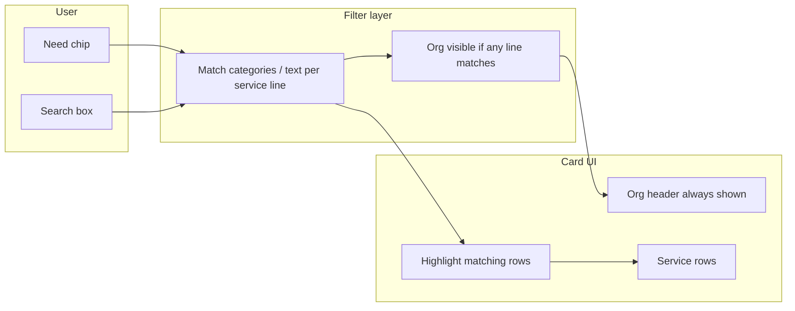
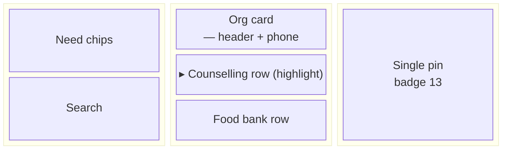
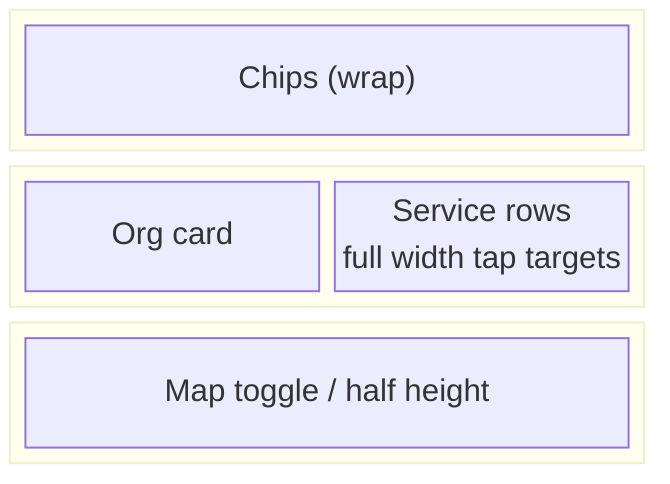

# Organisation / service grouping — UX options

**Date:** 10 August 2026 (proposed sibling-row UX added 13 August 2026; **implemented** 13 August 2026)  
**Status:** Design + data analysis; **Option B** grouping is in the directory UI (`group-services.mjs` + `directory.js`). **§12 “See other services” and labels on expand is implemented.**  
**Audience:** Porirua Locality product, stakeholders, developers  

**Related:** [Org / subservices deficit](../potential-changes-and-insights.md#org--subservices-deficit-highlight) · [FSD org plan](../plans/fsd-org-subservices-and-geo-filter.md) · Analysis artifact: [`porirua_directory/data/org-clusters-preview.json`](../porirua_directory/data/org-clusters-preview.json) · Script: `porirua_directory/scripts/analyze-org-clusters.mjs`

---

## 1. Problem statement

The NZ Family Services Directory (FSD) export is **one row per service line**. Phase 1 import turns each row into one **listing card** in `services.json`. Large providers therefore appear as **many similar cards** with the same organisation name, often the same phone and address, and sometimes **identical opening paragraphs** in the description.

Users (help-seekers and community connectors) expect **one organisation (or one site)** with **several offerings** underneath — the same mental model as the **Community Connections Map** (one pin, initiatives listed in the sheet).

Today:

- There is no `organizationId`, nested `services[]`, or grouped card in the UI.
- **`id` is slugged from provider name only**, so multiple rows share one `id` while remaining separate array entries — **My list** and deep links cannot distinguish service lines reliably.

Need filters (e.g. **Feeling unsafe**, **Support and counselling**) should **surface the relevant offering** without hiding the org context.

---

## 2. Data analysis summary

**Source:** Published `services.json` (Aug 2026 rebuild): **434** listings (**52** `community`, **382** `fsd`).

**Method:** `node scripts/analyze-org-clusters.mjs` clusters by:

| Signal | Definition |
|--------|------------|
| Normalised org name | Same `name` after trim / whitespace collapse (case-insensitive) |
| Site key | `dedupeKey(name, lat, lng)` — name + coords rounded to 3 decimals |
| Phone / address | Normalised `phone` and `address` included in cluster key |
| Duplicate description | First 200 chars of description (flags repeated boilerplate) |

### Key counts

| Metric | Value |
|--------|------|
| Distinct normalised names with **≥ 2** listings | **76** |
| Listings in those multi-service name groups | **367** (~**85%** of published rows) |
| FSD-only name groups (≥ 2) | **75** |
| Groups sharing one duplicate `id` (≥ 2 rows) | **76** |
| Duplicate-description groups (≥ 2 rows) | **93** |

**Interpretation:** Most FSD volume is multi-row under a stable provider name at one site. Community rows are **org-grain** (52 single-card orgs); the grouping problem is overwhelmingly **FSD-in-support-mode**.

### Examples (stakeholder-facing)

| Pattern | Listings (same normalised name) | Notes |
|---------|----------------------------------|--------|
| Maraeroa Marae Health Clinic | 17 | Same `fsd-maraeroa-marae-health-clinic` id |
| Porirua Whanau Centre | 17 | Same id |
| Work and Income — Porirua Community Link | 16 | Same id |
| **The Salvation Army — Porirua** | **13** | Canonical “many cards” example |
| Family Works Central | 9 | **7 rows** share identical description opener (regional centre text) |
| Te Runanga o Toa Rangatira | 11 | Māori health / social hub pattern |
| Little Shadow | 5 | Same id, repeated description blocks |
| Literacy Aotearoa — Upper Hutt | 6 | FSD site naming; multi-line education |

**Capital & Coast / Te Whatu Ora:** Provider strings vary (**Capital & Coast DHB Rehabilitation Service**, **Child Adolescent Mental Health Services, Capital & Coast DHB**, **Capital Support**). **7** capital-related rows in the slice; **2** rehabilitation rows are **byte-identical** descriptions under the same name — a **name-variant + duplicate-text** pattern that pure name clustering under-counts unless Phase 2 adds a **provider root** (e.g. FSD `FSD_ID` parent or manual org alias table).

### Community vs FSD

| Source | Rows | Grouping today |
|--------|------|----------------|
| `community` | 52 | Already one card per org; initiatives in `communityMeta.initiatives` |
| `fsd` | 382 | Flat cards; merge dedupes **community vs FSD** only, not FSD-vs-FSD |

Name overlap between a community org and an FSD provider name in this snapshot: **0** exact normalised matches (FSD duplicates of community orgs are **hidden at merge**, not shown as extra cards).

---

## 3. Personas

### Help-seeker (Find support)

| Goal | Behaviour | Grouping need |
|------|-----------|---------------|
| Find **specific** help (safety, counselling, food) | Uses **need chips**, search, maybe map | Chip should **highlight** the matching **service line** inside the org, not repeat 13 full cards |
| Compare who to call | **My list**, `tel:` links | Save **org** or **specific service** with clear label on print/list |
| Low patience / stress | Skims titles, crisis footer | Org header + short service titles; avoid scrolling duplicate blurbs |

### Community connector (Connect with community)

| Goal | Behaviour | Grouping need |
|------|-----------|---------------|
| Find **groups**, kai, marae, schools | **Org-type chips**, map density | Prefer **one pin per org** with theme/initiatives (already on community rows) |
| See what’s active locally | Map + website | FSD-heavy map clutter is less central but still visible in “all pins” futures |
| Share with whānau | My list, print | Org-level favourite usually enough; subservices less critical |

---

## 4. UX options (3–4)

### Option A — Collapsed org card (default closed)

**Pattern:** One card per org in results; body shows address, phone, website; **“N services”** chevron collapsed by default. Expand reveals full list.

| Pros | Cons |
|------|------|
| Shortest scroll; familiar accordion | User may miss a service unless filter/search opens it |
| Works on mobile stack | SEO/snippet less granular per service |
| One **Add to list** at org level is simple | Per-service call numbers hidden until expand |

**Filter highlight (MVP implemented):** Need chips are **multi-select union (OR)** — tap to add, tap again to remove that topic; several chips show listings that match **any** selected need. Orgs with a matching subservice stay in results; the card shows **only matching service rows**, each with a highlighted category pill (`.badge--need-match`) for selected needs on that line. Non-matching rows are hidden until **See other services** (only when sibling lines exist). Search still uses row-level `.service-row--match` / `.service-row--dim` when no need chip is selected; need + search both apply to the same service line. **Implemented:** [§12](#12-proposed-ux-see-other-services-and-labels-on-expand).

---

### Option B — Org header + always-visible service rows (recommended direction)

**Pattern:** Single card shell: **org name**, contact, map pin once. **Service rows** as subcards or `<ul>` lines (title + 1-line detail + optional **Call**). No second full description block per line unless expanded.

| Pros | Cons |
|------|------|
| Matches **Connections Map** “org + initiatives” | Taller cards for 10+ services |
| Filter chip can **glow** matching rows without hiding org | Requires **service-level titles** from FSD (`SERVICE_NAME`) in data |
| My list can offer **org** + “add this service” on row | Layout work in **three-column** (narrow middle column) |

**Filter highlight (MVP implemented):** Active need chips (multi-select **union**: listing matches **any** selected need) keep the org if any line matches, show **only matching rows**, and add `.badge--need-match` on pills for the selected needs on that line. **See other services** reveals hidden sibling lines on that card (omitted when nothing is hidden). With no chips, all rows show **without** need-category pills until a row is expanded. Search matches org name **or** any subservice title (`.service-row--match` / `.service-row--dim` when browsing all rows); combined need + search requires a line that satisfies both. **Implemented:** [§12](#12-proposed-ux-see-other-services-and-labels-on-expand) (sibling expand + labels on row open).

**My list:** Default **add org**; optional row-level control stores `{ orgId, serviceLineId }` in session storage when ids exist.

---

### Option C — Flat cards with “same org” visual merge (UI-only spike)

**Pattern:** Keep one DOM card per FSD row but **visually stack** consecutive rows with the same `id` / normalised name (shared header, reduced padding between “siblings”).

| Pros | Cons |
|------|------|
| ~1–2 day spike; no schema change | **Fragile:** name variants (Capital Coast) don’t stack |
| Search/filter unchanged at data layer | My list still broken for duplicate ids |
| Low risk read-only experiment | Map still **N pins** at same coords |

**Filter highlight:** Highlight entire sibling group if any row matches — weaker than row-level highlight.

---

### Option D — Map-first: one pin per org, popup service list

**Pattern:** Results list may stay flat or grouped; **map** shows **one marker per org** with count badge; popup lists services; **View in directory** scrolls to org card (Option B).

| Pros | Cons |
|------|------|
| Fixes stacked identical pins | Popup long for 17-line orgs |
| Strong for **community connector** map browsing | Desktop three-column map already tight |
| Complements landing **map-first** options | Needs clustering + grouped data for correctness |

**Filter highlight:** Popup greys out non-matching services; pin remains if **any** service matches (or hide pin if none — product choice).

---

## 5. Filter → highlight behaviour (cross-option)



| Event | Recommended behaviour (Option B) **today** |
|-------|----------------------------------|
| One or more need chips (union / OR) | Show org if **any** line matches **any** selected need; show **only** those lines with matching need pills; **See other services** if sibling lines are hidden |
| Clear chips | Show all rows again without need pills (until a row is opened) |
| Typing in search | Highlight lines matching query; org matches on name; with chips on, a line counts as a match only if it satisfies **both** (need union **and** query) |
| **Near me** + chip | Same rules on geo-filtered subset |
| Map pin click | Compact popup (teaser titles + **View in list**); matching chips do not expand the popup; no **See other services** in the popup |

**Accessibility:** Highlight must not rely on colour alone (weight, icon, `aria-current` on row); expand state on `aria-expanded`; live region announces “N organisations, M matching services”.

**Sibling expand + labels on row open:** [§12](#12-proposed-ux-see-other-services-and-labels-on-expand).

---

## 6. My list: org vs service

| Approach | Help-seeker | Community connector | Implementation |
|----------|-------------|---------------------|----------------|
| **Org only** | Simple; may lose which counselling line | Usually sufficient | One `favoriteId` = org slug |
| **Service line** | Precise for callbacks | Rare | Requires unique `serviceLineId` (FSD `SERVICE_ID`) |
| **Hybrid (recommended)** | Primary button **Add org**; row **Pin this service** | Org default | Storage: `{ version, items: [{ orgId, serviceLineId? }] }` |

**Migration:** Phase 1 duplicate ids mean toggling favourite on any Salvation Army row may toggle all — grouping + unique ids is a **prerequisite** for service-level favourites.

---

## 7. Layout sketches

### Desktop — three-column (`data-browse-layout="three-column"`)



- Filters column unchanged (sticky).
- Results: org cards scroll independently; highlighted row gets left accent bar.
- Map: Option D reduces pin stack; click syncs scroll to org in centre column.

### Mobile — stacked



- Prefer **Option B rows** over nested accordions for thumb reach (`min-height` 44px).
- **Call** on row uses `tel:` when line-specific number exists, else org phone.

---

## 8. Phasing

| Phase | Scope | Delivers |
|-------|--------|----------|
| **This PR** | Analysis JSON + design doc + read-only script | Shared stats, UX choice, stakeholder review |
| **MVP spike (optional)** | Option C or client-side group by shared `id` in `directory.js` only | Demo in branch; not shipped without product sign-off |
| **Phase 1.5 pipeline** | Unique `id` per FSD row (`SERVICE_ID`); optional display `serviceName` | Fixes favourites/deep links; still flat UI |
| **Phase 2** | Import grouping (`organizationId`, `services[]` or parallel org records); merge rules; overrides at org/service level; E2E | Option **B + D** production quality |

**Recommendation:** Pursue **Option B (org header + highlighted service rows)** with **Option D** for map pins, implemented on **Phase 2 schema** after **Phase 1.5 unique ids**. Option C is acceptable for a **throwaway usability prototype** only.

**Rationale:**

1. Aligns with community map grain and stakeholder mockups in [potential-changes](../potential-changes-and-insights.md).
2. Need chips map naturally to **service-line categories** — highlight beats hiding duplicate cards.
3. **76** orgs × duplicate ids makes My list and analytics unreliable until ids + grouping land together.
4. UI-only grouping (C) does not fix Capital Coast **name variants** or editor workflow in Directus.

---

## 9. Open questions for user testing

1. Default **expanded** or **collapsed** for orgs with &gt; 5 services?
2. Card title: **org only** vs org + primary matching service when filtered?
3. When community and FSD represent the same org in Phase 2, do FSD lines appear **under** the community card?
4. Map: show pin if **any** service matches filter, or only when org HQ matches **near me**?
5. **See other services** copy: “See other services” vs “Show N more services”?
6. When search + need are both on, should revealed siblings that match the **query** (but not the need) get `.service-row--match`, or stay equally de-emphasised as “other”?

---

## 10. Verification

Re-run analysis after each `npm run build:data`:

```bash
cd porirua_directory
node scripts/analyze-org-clusters.mjs
```

Compare `clustering.orgsWithSameNormalizedName2Plus` and top-of-list providers against stakeholder expectations.

---

## 11. Implementation (Option B — merge pipeline)

| Area | Approach |
|------|----------|
| Grouping | **`scripts/org-grouping.mjs`** at merge; published `services.json` includes `kind: "organization"` + `services[]`. FSD `id` = `fsd-<FSD_ID>`. |
| UI | `directory-data.js` expands lines for filters; `groupCatalogForDisplay` renders org cards from catalog. |
| Favourites | Org-level `id` / `orgId`. |
| Map | One pin per org; popup **View in list** focuses org card. **Find support** popups show need categories (and FSD badges) only — no Connections Map org-type or Assembly theme pills. **Community** popups show **org type** plus filter/category pills; Assembly **themes**, **initiatives**, and **label chips** from `communityMeta` are not shown (data retained for pipeline/filters). |
| Need filter | Org in list if **any** line matches **any** selected need (union); card shows **only matching** lines with `.badge--need-match`. Filter pipeline does **not** pull sibling lines into the result set (`expandNeedFilterLines` / `orgServiceLinesForDisplay`). **See other services** on the card reveals hidden siblings (`orgCardServiceLines`, `orgHasHiddenSiblingLines`) without changing the filter. Status live region: “N organisations (M matching service lines)”. **Card control:** [§12](#12-proposed-ux-see-other-services-and-labels-on-expand). |
| Service detail | Each row is a **toggle button** (`aria-expanded`) revealing `.service-row__detail` (description, line-specific contact when different from org). Opening a row shows **that line’s need-category labels** (with or without chips). With chips on, collapsed matching rows show highlighted pills for selected needs; revealed sibling rows show their category labels. Org **Call** unchanged; row clicks do not open the map popup. **Implemented:** [§12](#12-proposed-ux-see-other-services-and-labels-on-expand). |

Matching rules: see [phase1 spec](../porirua-directory-phase1-spec.md) dedupe section and table in prior design review (exact name + geo/phone/address tie-break for community↔FSD).

---

## 12. Proposed UX: “See other services” and labels on expand

**Status:** **Implemented** (13 August 2026) in `group-services.mjs` + `directory.js` (E2E in `e2e/directory.spec.js`). Builds on shipped Option B org cards and **multi-select union** need chips (tap to add, tap again to remove; several chips = listings matching **any** selected need). Applies to **org cards that have service rows** (FSD multi-line orgs in Find support), not community org-grain cards.

**Filter pipeline (unchanged):** `orgServiceLinesForDisplay` shows all rows when no chips are on, and **only need-matching rows** when one or more chips are on. Collapsed rows get `.badge--need-match` pills only while chips are on (selected matching needs). Expanding a row (`service-row__toggle`) shows description/contact and **that line’s categories**. Map org popup stays compact (up to two teaser titles + **View in list**) — no **See other services** in the popup.

### Problem

Someone who finds **The Salvation Army — Porirua** via **Food** sees only the food line. Budgeting, counselling, and work training at the same org stay hidden until they **clear chips**. That breaks the “one org, several offerings” model the grouped card is meant to deliver.

With **no** chips, every line is listed, but **need-category pills stay off the collapsed rows** so the default browse view stays short. Opening a row lists that line’s categories.

### Proposal A — “See other services” (implemented)

Keep the current filter pipeline: an org appears if **any** line matches **any** selected need; default visible rows are the **matches**, with **highlighted matching pills**.

**Hard rule — omit the control unless something is hidden.** **“See other services”** appears **only** when that organisation has **more service lines than the ones already shown**. It is not a decorative footer on every org card.

| Situation | Button? |
|-----------|---------|
| Org has a **single** service line | **No** — nothing to reveal |
| One or more need chips on, and **every** line already matches (union) | **No** — nothing is hidden |
| Chips on, and the org has sibling lines that are currently hidden | **Yes** |
| No chips (all rows already shown) | **No** |

Clicking the button reveals the remaining (currently hidden) lines **on that card only**. It must **not** add siblings into `expandNeedFilterLines` (that would let search hit a non-need sibling and then hide the need-matching row — see `group-services.mjs`). Collapsed label **See other services**; expanded **Hide other services**. Revealed rows should show **their category labels**. Matching rows stay at the top with highlighted matching pills.

### Proposal B — always show all rows

Always list every line; dim or de-emphasise non-matching ones (`.service-row--dim` or similar). No extra control. **Noisier** on 10–17 line orgs (Salvation Army, marae clinics) while a chip is on — called out as the weaker default.

### Service row expand — show that line’s labels

When the person **opens a service row** (`aria-expanded` on the existing toggle), show **that line’s need-category labels** (pills or the existing “Categories:” line). This should apply **with or without chips** — not only when a need filter is selected. With chips on, matching selected needs stay **highlighted** (`.badge--need-match`); other categories on the same line may still appear, unhighlighted.

### Search

Keep today’s rule for **what counts as a match:** with search **and** need chips both on, a line must match **both** (need union **and** query) for the org to stay in results and for default visible rows. **See other services** still reveals siblings at that org (subject to the omit rule above). Recommend applying existing search-dimming to revealed rows (`.service-row--match` / `.service-row--dim`); do not change which orgs appear.

### Map popup

Keep the org pin popup **compact** (teaser titles + **View in list**). Do **not** add **See other services** in the popup. The **full card** is the source of truth for sibling lines.

### Accessibility

The sibling control is a **`<button type="button">`**, not a fake link; set **`aria-expanded`**. Match vs other must not rely on colour alone (weight, labels, `aria-current` on matching rows — same bar as §5).

