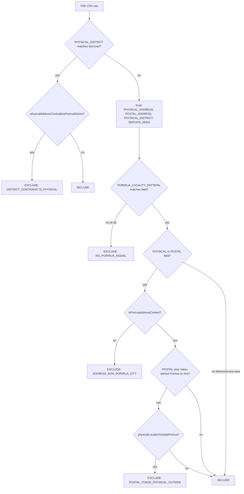

# FSD Porirua geographic filter — rationale and audit

**Audience:** Developers and data editors refreshing the NZ Family Services Directory (FSD) slice  
**Implementation:** `porirua_directory/scripts/fsd-porirua-rules.mjs`  
**Pipeline:** `npm run import:fsd` → `data/fsd-porirua.raw.json` + **`data/fsd-porirua-excluded.json`** (geo filter audit) + **`data/fsd-porirua-geocode-flags.json`** (coordinate QA on included rows)  
**Summary spec:** [porirua-directory-phase1-spec.md](./porirua-directory-phase1-spec.md) § FSD inclusion rules  
**Operational steps:** [MVP-RUNBOOK.md](./MVP-RUNBOOK.md) § FSD import audit

---

## Purpose

The directory publishes a **Porirua-relevant subset** of the national FSD CSV (~tens of thousands of rows). Filters must:

1. **Include** providers that serve or are located in Porirua City and agreed adjacent localities.
2. **Exclude** rows that only match **homonym suburbs**, **street names**, or **bad FSD metadata** (district says Porirua, street says Palmerston North).
3. Leave an **auditable trail** when DIA publishes a new CSV so someone can spot-check exclusions, update rules, and add regression tests.

There is **no separate reject log in code before August 2026** beyond “row not in `fsd-porirua.raw.json`”. From August 2026, **`data/fsd-porirua-excluded.json`** lists every rejected row with a stable **`reasonCode`**.

---

## Decision flow (include vs exclude)

**Note:** `PHYSICAL_DISTRICT` is scanned both as the fast **Porirua district** path (step B) and as a field in the token scan (step D). A non-Porirua district that accidentally contains a substring token is rare; the district path takes precedence when `/porirua/i` matches.

---

## Rules and rationale

| # | Rule | Rationale | Primary code if excluded |
|---|------|-----------|----------------------------|
| 1 | **Porirua district** — `PHYSICAL_DISTRICT` matches `/porirua/i` | DIA often sets district correctly; this is the strongest signal. | — (included) unless rule 2 fires |
| 2 | **District vs physical cross-check** — if district is Porirua but `PHYSICAL_ADDRESS` names another city/town from the blocklist and does **not** contain “Porirua”, drop the row | FSD metadata can be wrong (e.g. Tautoko Services: district Porirua City, address Palmerston North). Trust the street line over district when they conflict. | `DISTRICT_CONTRADICTS_PHYSICAL` |
| 3 | **Suburb / locality tokens** — match `PORIRUA_LOCALITY_PATTERN` on address, postal, district (non-Porirua), or service area | Captures providers filed under Wellington region with suburb text but empty/wrong district. | — |
| 4 | **Address context** — for `PHYSICAL_ADDRESS` and `POSTAL_ADDRESS`, a token match is **ignored** if the same line also matches `NON_PORIRUA_ADDRESS_LOCALITY_PATTERN` unless the line contains “Porirua” | Suburb names are not unique nationally (`Whitby`, `Ranui`). Street names embed tokens (`Whitby Street`, `Ranui Avenue`). | `ADDRESS_NON_PORIRUA_CITY` |
| 5 | **Postal vs physical** — a `POSTAL_ADDRESS` token match without “Porirua” on that line is ignored when `physicalLocationOutsidePorirua` is true | Postal lines often say `Ranui, 0612` without “Auckland”; physical region/district/address may be Waitakere / Massey. | `POSTAL_TOKEN_PHYSICAL_OUTSIDE` |
| 6 | **Rānui vs Aranui** — Rānui token uses `(?<![a-z])r[āa]nui\b` | JavaScript `"Aranui".match(/r[āa]nui/i)` is true; Christchurch **Aranui** must not match Porirua **Rānui**. | `NO_PORIRUA_SIGNAL` (no token match) |
| 7 | **No Porirua signal** — Wellington-region-only or national rows with no qualifying token | Phase 1 scope is Porirua slice, not all Wellington FSD. | `NO_PORIRUA_SIGNAL` |

**Categories** (`mapCategoriesFromFsd`) run **after** geo filter; they do not affect inclusion.

**Coordinates** — DIA supplies `LATITUDE` / `LONGITUDE` on each CSV row. Import copies them via `mapFsdRowToService` (no geocoder in this repo). **Geocode QA** runs on **included** rows only; see [Geocode QA (included rows)](#geocode-qa-included-rows).

**Public/private or quality** — not filtered in code; use `data/overrides.json` at merge time.

---

## Exclusion reason codes

Defined in `PORIRUA_EXCLUSION_REASON` in `fsd-porirua-rules.mjs`. Each excluded row in `fsd-porirua-excluded.json` includes:

| Field | Meaning |
|-------|---------|
| `reasonCode` | One of the codes below |
| `reasonDetail` | Short human-readable explanation |
| `matchedField` | When relevant: which address field triggered the veto |
| `SERVICE_ID`, `FSD_ID` | DIA identifiers (when present in CSV) |
| `PROVIDER_NAME`, `SERVICE_NAME` | Spot-check labels |
| `PHYSICAL_*`, `POSTAL_ADDRESS` | Location fields from CSV |

| Code | When used |
|------|-----------|
| `DISTRICT_CONTRADICTS_PHYSICAL` | Rule 2 — bad district Porirua + out-of-area physical address |
| `ADDRESS_NON_PORIRUA_CITY` | Rule 4 — token matched but line names another city |
| `POSTAL_TOKEN_PHYSICAL_OUTSIDE` | Rule 5 — postal suburb token + physical location outside Porirua |
| `NO_PORIRUA_SIGNAL` | Rule 7 — no include path (includes former Aranui false positives) |

---

## Worked examples (include / exclude)

| Scenario | Sample address / metadata | Result | Why |
|----------|---------------------------|--------|-----|
| Porirua district | `PHYSICAL_DISTRICT: Porirua` | **Include** | Rule 1 |
| Tautoko / PN | District Porirua City; `31 Princess Street, Palmerston North` | **Exclude** | Rule 2 — `DISTRICT_CONTRADICTS_PHYSICAL` |
| Whitby, Porirua | `4 Hikoi Way, Whitby, Porirua, 5024` | **Include** | Rule 4 — “Porirua” on line |
| Dunedin Whitby St | `3 Whitby Street, Mornington, Dunedin` | **Exclude** | Rule 4 — `ADDRESS_NON_PORIRUA_CITY` |
| Rānui, Porirua | `10 Awatea Street, Ranui, Porirua, 5024` | **Include** | Rule 4 — Porirua on line |
| Auckland Ranui | `32 Pooks Road, Ranui, Auckland` | **Exclude** | Rule 4 — Auckland on line |
| Kerikeri street name | `41 Ranui Avenue, Kerikeri` | **Exclude** | Rule 4 — Kerikeri on line |
| sKids Massey | Physical Massey/Waitakere; postal `16 Platinum Rise, Ranui, 0612` | **Exclude** | Rule 5 — `POSTAL_TOKEN_PHYSICAL_OUTSIDE` |
| Christchurch Aranui | `250 Pages Road, Aranui, Christchurch` | **Exclude** | Rule 6 — no Rānui token match |
| Ranui Grove Porirua | `12 Ranui Grove, Porirua` | **Include** | Rule 3 + 4 |
| Wellington only | `PHYSICAL_REGION: Wellington`, empty district | **Exclude** | Rule 7 — `NO_PORIRUA_SIGNAL` |
| Titahi Bay | `5 Beach Road, Titahi Bay` | **Include** | Rule 3 — token match |

Regression tests: `porirua_directory/tests/fsd-import.test.mjs`.

---

## Geocode QA (included rows)

Geo **inclusion** (suburb tokens, district cross-check) does **not** validate map coordinates. Bad DIA geocodes can pass the filter and still plot offshore — e.g. **Porirua Respiratory Support group – Ora Toa** (`FSD_ID` 4690): Porirua district, empty address, lat/lng **−41.080194, 174.760239** in Cook Strait. See [fixed-fsd-ora-toa-respiratory-sea-marker.md](./issues/fixed-fsd-ora-toa-respiratory-sea-marker.md).

**Implementation:** `porirua_directory/scripts/fsd-geocode-qa.mjs`, invoked from `buildFsdImportReport` in `fsd-import.mjs`.

**Artifact:** `data/fsd-porirua-geocode-flags.json` (gitignored, regenerated each `import:fsd`). Rows stay in `fsd-porirua.raw.json` unless you hide them via overrides — flags are for **human review**, not auto-drop.

| Field | Meaning |
|-------|---------|
| `geocodeFlagCount` | Number of included rows with at least one flag |
| `geocodeFlags[]` | One entry per flagged row |
| `reasonCode` | See table below |
| `reasonDetail` | Short explanation |
| `serviceId` | Slug used in `services.json` after merge |
| `lat`, `lng` | Values from FSD CSV at import time |
| `FSD_ID`, names, address fields | Spot-check labels |

| Code | When used |
|------|-----------|
| `GEOCODE_IN_MARINE_BBOX` | Pin inside the Kapiti/Cook Strait offshore check box (`KAPITI_OFFSHORE_MARINE_BBOX`) |
| `GEOCODE_OUTSIDE_PORIRUA_BOUNDS` | Pin outside the generous Porirua map box (`PORIRUA_GEO_BOUNDS`) and not already caught as marine |

**Review workflow (who / what):**

| Step | Owner | Action |
|------|--------|--------|
| After each FSD CSV drop | Developer or data editor running `npm run build:data` | Read console `geocodeFlagCount`; open `fsd-porirua-geocode-flags.json` |
| For each flag | Data editor + stakeholder if public-facing | Confirm on map (local `npm run serve`) or against known site address; check community map / provider website |
| Fix | Data editor | Add **`patches`** in `data/overrides.json` (`lat`, `lng`, optional `address`) → `npm run merge:services`; or `hiddenIds` if not mappable; or report upstream to DIA FSD |
| Policy change | Developer | Adjust bounds in `fsd-geocode-qa.mjs`, add tests in `fsd-geocode-qa.test.mjs`, update this section |

**Manual checks (still useful):** Scan `services.json` FSD pins on the map after merge; search for empty `address` with non-null coords; compare flagged `serviceId` list to overrides.

Operational checklist: [MVP-RUNBOOK.md](./MVP-RUNBOOK.md) § FSD geocode QA.

---

## Token maintenance

### `PORIRUA_LOCALITY_PATTERN`

Agreed Porirua and nearby locality names (Titahi Bay, Whitby, Cannons Creek, Waitangirua, Kenepuru, Plimmerton, Paekākāriki, Rānui, Elsdon, Pukerua, Takapūwāhia, Hongoeka, etc.). **Change only with stakeholder agreement** — each new token can create national false positives.

### `NON_PORIRUA_ADDRESS_LOCALITY_PATTERN`

Named cities/towns used to veto suburb-token matches on the **same line**. Extend when data review shows a new false positive (same pattern: suburb token + another city on one line). Prefer **adding a city** over tightening suburb tokens when the failure mode is “wrong city on the address line”.

### Auckland / West Auckland physical check

`physicalLocationOutsidePorirua` uses `PHYSICAL_REGION === Auckland`, Auckland metro districts (Waitakere, Massey, Henderson, …), and physical address tokens — not the full national city list. Extend when postal-only false positives appear with physical addresses in other regions.

### When DIA changes the CSV schema

1. Run `npm run import:fsd` and confirm the script still parses (`relax_column_count: true` tolerates minor drift).
2. If columns rename or move, update `fsd-import.mjs` / `mapFsdRowToService` field names and this doc.
3. Re-run `npm test` and spot-check `fsd-porirua-excluded.json` counts vs previous drop (save a copy before rebuild if comparing releases).
4. Update [porirua-directory-phase1-spec.md](./porirua-directory-phase1-spec.md) if inclusion semantics change.

---

## Changelog (filter policy)

| Date | Change | Issue write-up |
|------|--------|----------------|
| **2026-08-10** | Geocode QA flags on import (`fsd-porirua-geocode-flags.json`, marine + bounds reason codes) | [fixed-fsd-ora-toa-respiratory-sea-marker.md](./issues/fixed-fsd-ora-toa-respiratory-sea-marker.md) |
| **2026-08-10** | Rānui regex: `(?<![a-z])r[āa]nui\b` — stop matching Christchurch **Aranui** | [fixed-fsd-aranui-christchurch-filter.md](./issues/fixed-fsd-aranui-christchurch-filter.md) |
| **2026-08** | `NON_PORIRUA_ADDRESS_LOCALITY_PATTERN` + `isPoriruaAddressContext` — Whitby Street / Ranui Auckland / Kerikeri Ranui Ave | [fixed-fsd-locality-address-context-filter.md](./issues/fixed-fsd-locality-address-context-filter.md) |
| **2026-08** | `physicalAddressContradictsPoriruaDistrict` — district Porirua vs physical Palmerston North (Tautoko) | Same issue doc |
| **2026-08** | `physicalLocationOutsidePorirua` — postal Ranui without Porirua on line + West Auckland physical (sKids Massey) | Same issue doc |
| **2026-08** | Audit artifact `data/fsd-porirua-excluded.json` + `reasonCode` on import | This doc; [MVP-RUNBOOK.md](./MVP-RUNBOOK.md) |

When you add or change a rule: update this changelog, add/adjust tests in `fsd-import.test.mjs`, link a new `docs/issues/fixed-*.md` if the fix was bug-driven, and refresh the phase 1 spec bullet list.

---

## Related

| Resource | Role |
|----------|------|
| [issues/README.md](./issues/README.md) | Fixed geo false-positive narratives |
| [plans/fsd-org-subservices-and-geo-filter.md](./plans/fsd-org-subservices-and-geo-filter.md) | Org/subservices (separate from geo filter) |
| `porirua_directory/data/overrides.json` | Hide or patch individual rows after merge |
